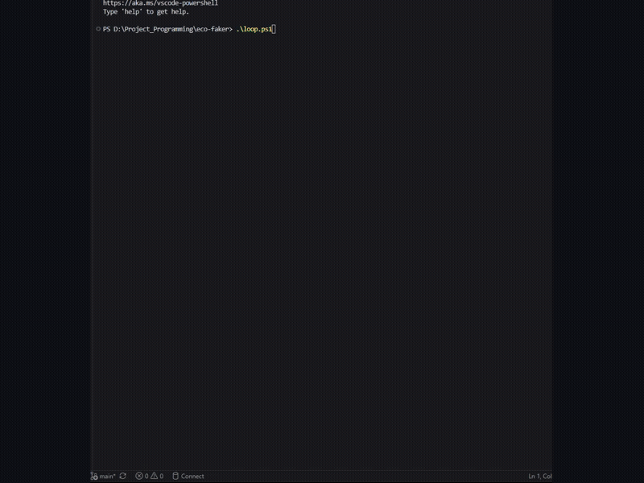

# eco-faker

[](https://github.com/Hung1510/Eco-Faker/actions/workflows/ci.yml)
[](https://www.npmjs.com/package/eco-faker)
[](https://www.npmjs.com/package/eco-faker)

Stateful, relationally-consistent fake-data generator for e-commerce apps. Not just a pile of random JSON — every `Cart`, `Order`, `Shipment`, and `ReturnRequest` is derived from the same underlying state machine, so the dataset reads like a real store's history instead of unrelated fixtures.

```
Users → Carts → (AbandonedCheckouts | Orders → Shipments → ReturnRequests)
```



**Try it in 30 seconds:**

```bash
npm install -g eco-faker
my-eco-gen generate --scenario black-friday --users 100 --format sql --output ./seed.sql
```

No Node? No problem:

```bash
docker compose up --build
# Postgres @ localhost:5432 (eco/eco/eco_faker) seeded with a Black Friday dataset
```

## Features

- **Shopping carts** — line items, quantities, status (`active` / `abandoned` / `converted`)
- **Abandoned checkouts** — recovery email timing, coupon offers, recovery outcome
- **Orders** — financially exact (`subtotal + tax + shipping === total`), locale-aware formatted currency (`totalFormatted`), free-shipping threshold, missing-address edge case
- **Shipment tracking** — realistic multi-stage event histories (`Label Created → Picked Up → In Transit → [Delayed] → Out for Delivery → Delivered`), multi-package orders
- **Return requests** — only for delivered orders, weighted approve/reject/pending, partial or full refunds, formatted refund amounts
- **Scenario presets** — `--scenario black-friday` swaps in a whole tuned config bundle for a recognizable business situation
- **Anomaly injection** — rare, high-value edge cases that stress-test downstream systems (see below)
- **Deterministic** — same seed + same reference time → byte-identical dataset; snapshot/replay for exact reproducibility
- **Three output formats** — JSON, SQL (Postgres-flavored `CREATE TABLE` + `INSERT`), CSV
- **Schema-aware output** — point it at an existing Prisma, Drizzle, or SQLAlchemy schema and it maps its own columns onto yours
- **High-volume streaming** — NDJSON straight to stdout, no dataset ever held fully in memory
- **Mock REST API** — `my-eco-gen serve` spins up a paginated, filterable, json-server-style API backed by a generated dataset, with optional chaos mode, API-key auth, an OpenAPI spec, a Postman collection export, and a live WebSocket event feed
- **Webhook event simulator** — replay the dataset as a paced, chronological stream of `order.created`/`cart.abandoned`/`shipment.delivered`-style events POSTed to a URL
- **Dataset diffing** — `my-eco-gen diff` reports row-count deltas, schema drift, and status-distribution shifts between two datasets or snapshots
- **Multi-store mode** — `--stores N` generates N independent, distinctly-seeded stores in one call
- **Interactive web playground** — sliders + live charts + RFM/cohort segmentation + side-by-side scenario comparison, backed by a small Express API
- **Static browser demo** — the same generator bundled with esbuild and running with zero server, deployable straight to GitHub Pages
- **One-command Postgres demo** — `docker compose up` generates a scenario and seeds a real database
- **CI-tested** — GitHub Actions runs typecheck/tests/build/smoke-test/CLI e2e/static-bundle-check on every push, PR, and nightly
- **CLI** — `my-eco-gen generate --users 50 --format sql --output ./seed.sql`

## Install

**As a CLI tool:**

```bash
npm install -g eco-faker
my-eco-gen --help
```

**As a library, in a project:**

```bash
npm install eco-faker
```

**From source** (for contributing, or to run the web playground / static demo):

```bash
git clone https://github.com/Hung1510/Eco-Faker.git
cd eco-faker
npm install
npm run build
```

## Quick start (2 lines)

```ts
import { generate, serialize } from "eco-faker";

const dataset = generate({ seed: 42, scaleFactor: 200 });
const sql = serialize(dataset, "sql"); // or "json" / "csv"
```

That's it — `dataset` already contains relationally-linked `users`, `carts`, `abandonedCheckouts`, `orders`, `shipments`, and `returnRequests`.

## CLI

```bash
npm install -g eco-faker   # or: npm link, if you're working from a source checkout
my-eco-gen generate --users 50 --format sql --output ./seed.sql

my-eco-gen generate \
  --users 100 \
  --format json \
  --output ./data/eco.json \
  --seed 7 \
  --abandonment-rate 0.45 \
  --delay-probability 0.25 \
  --max-delay-days 5
```

Run `my-eco-gen generate --help` for the full flag list. Every flag maps 1:1 to a field in `config.schema.json`.

---

## Scenario presets

Instead of hand-tuning a dozen rates, apply a named business scenario -- a whole pre-tuned config bundle:

```bash
my-eco-gen scenarios   # list all presets with their key values

my-eco-gen generate --scenario black-friday --format sql --output ./black-friday.sql
my-eco-gen generate --scenario post-holiday-returns --format json --output ./returns.json
```

| Scenario | Story | Key tuning |
|---|---|---|
| `black-friday` | Traffic spike, overwhelmed checkout | high `scaleFactor` + `abandonmentRate`, low `delayProbability` (logistics hasn't caught up yet) |
| `post-holiday-returns` | Weeks after peak season | high `returnRate` + `delayProbability` (carrier backlog), low new-cart activity |
| `flash-sale` | Short, intense burst | very high `abandonmentRate` (stock races out before checkout), tiny `historicalDays` window |
| `supply-chain-crisis` | Logistics network under strain | high `delayProbability` + `maxDelayDays` + `multiPackageRate` (partial fulfillment) |
| `steady-state` | Ordinary day-to-day traffic | close to `DEFAULT_CONFIG`, named for symmetry |

Explicit flags still win over the scenario -- `--scenario black-friday --users 50` uses Black Friday's abandonment/delay/coupon tuning but only 50 users, not the preset's 2,000. This is the same precedence a snapshot records, so `--scenario X --snapshot ./run.json` captures the fully-resolved recipe, scenario included.

Programmatically:

```ts
import { generate, SCENARIOS, resolveScenario, mergeOverrides } from "eco-faker";

const dataset = generate(mergeOverrides(resolveScenario("black-friday"), { scaleFactor: 500 }));
```

---

## Mock REST API ("json-server for e-commerce")

Build or demo a frontend against a realistic, stateful backend without waiting on a real API:

```bash
my-eco-gen serve --users 300 --scenario black-friday --port 4000
```

```
GET  /                                             endpoint list + row counts
GET  /api/orders?status=delivered&page=2&pageSize=25
GET  /api/orders?sort=total&order=desc
GET  /api/shipments/:id
GET  /api/users | /api/carts | /api/abandoned-checkouts | /api/orders | /api/shipments | /api/returns
GET  /openapi.json                                 OpenAPI 3.0 spec -- import into Postman/Insomnia/Swagger UI
```

Any query param other than `page`/`pageSize`/`sort`/`order` is treated as an exact-match filter against that field (`?status=delivered`, `?userId=...`). It's deliberately simple -- no query language, just enough surface to build and demo a real UI against. All the usual flags apply (`--scenario`, `--seed`, `--bot-cart-rate`, etc.) since it's generating data through the same pipeline as `generate`.

### Chaos mode -- don't just mock the happy path

```bash
my-eco-gen serve --users 300 --chaos
my-eco-gen serve --users 300 --chaos --chaos-error-rate 0.2 --chaos-rate-limit-rate 0.1 --chaos-latency-rate 0.3
```

Every `/api/*` request rolls the dice: a simulated `429` (with a `Retry-After` header), a simulated `500`, an injected latency spike (300-2000ms by default), or -- most of the time -- the normal response. Defaults are `errorRate=0.05`, `rateLimitRate=0.05`, `latencyRate=0.2`; tune each independently. `/` and `/openapi.json` are never affected, so tooling and docs stay reachable even under chaos. This is the same "don't just generate the happy path" philosophy as anomaly injection, applied to the API layer instead of the data layer.

### API-key auth simulation

```bash
my-eco-gen serve --users 300 --api-key my-secret-key
curl -H "Authorization: Bearer my-secret-key" http://localhost:4000/api/orders
```

Every `/api/*` request without a matching `Authorization: Bearer <key>` header gets a `401`. One static key, no scopes or expiry -- the point is forcing frontend code to exercise its 401-handling path, not modeling real auth.

### Live WebSocket event feed

```bash
my-eco-gen serve --users 300 --live --live-interval-ms 500
```

Opens `ws://localhost:4000/live`, broadcasting one dataset-derived event every `--live-interval-ms` (default 800ms) to every connected client -- literally "watch orders roll in" instead of a static chart. It reuses the same event list the webhook simulator builds, so a `shipment.delivered` message references a shipment also reachable via `GET /api/shipments/:id` on the same server -- consistent ids across the REST API and the live feed. Loops back to the start when the event list is exhausted.

### Postman collection export

```bash
my-eco-gen serve --users 300 --postman
my-eco-gen serve --users 300 --postman --postman-output ./my-collection.json --api-key my-secret-key
```

Writes a ready-to-import Postman Collection v2.1 file to disk at startup (default `./eco-faker.postman_collection.json`) *and* serves it live at `GET /postman.json` -- import via file or via URL, whichever's more convenient. One folder per resource (Users, Carts, Abandoned Checkouts, Orders, Shipments, Returns), each with a pre-filled "List" request (page/pageSize/sort/order params, plus a disabled example filter) and a "Get by id" request. If `--api-key` is set, the collection gets a matching collection-level Bearer auth block, so authenticated requests work the moment you import it -- no manual header setup. Both the file and the `/postman.json` endpoint are generated from the exact same `TABLE_ROUTES` the REST server and the OpenAPI spec use, so all three never drift out of sync with each other.

## Webhook event simulator

Replay the dataset as a paced, chronological stream of webhook events -- exactly what a Stripe/Shopify-style webhook consumer needs to test against:

```bash
my-eco-gen webhook --url http://localhost:3000/webhooks --scenario post-holiday-returns --speed 3600
my-eco-gen webhook --url https://example.com/hook --events order.created,shipment.delivered --limit 50 --dry-run
```

- `--speed 3600` means 1 simulated hour of dataset history per real second (so a 90-day `historicalDays` span replays in ~36 minutes; tune to taste).
- `--max-wait-ms` (default 5000) caps the real-world wait between any two events, so a rare multi-day gap in the data doesn't stall the replay.
- Shipment tracking is the richest source: every entry in a shipment's event history becomes its own webhook (`shipment.label_created`, `shipment.picked_up`, ..., `shipment.delayed`, `shipment.delivered`), each with its own real timestamp.
- `--dry-run` prints `[i/n] timestamp type` instead of POSTing, so you can preview the timeline before pointing it at a real endpoint.

Event types emitted: `user.created`, `cart.created`, `cart.abandoned`, `checkout.abandoned`, `checkout.recovery_email_sent`, `order.created`, `shipment.<status>` (per tracking-event stage), `return.requested`, `return.approved` / `return.rejected`.

## Dataset diffing

"Did this dependency bump silently change the shape of my data?" -- diff two datasets (from `generate --format json`) or two snapshot recipes (from `generate --snapshot`), auto-detected either way:

```bash
my-eco-gen diff ./before.json ./after.json
my-eco-gen diff ./bug-42.snapshot.json ./bug-43.snapshot.json --fail-on-schema-change   # for CI
```

```
Row counts (./before.json -> ./after.json):
  users                    50 -> 50     (+0, +0.0%)
  orders                   84 -> 75     (-9, -10.7%)
  ...

Schema drift (added/removed fields per table):
  (none)

Cart status distribution:
  converted                84 -> 75     (-10.7%)
  abandoned                35 -> 50     (+42.9%)
  ...
```

Schema-drift detection only compares field sets when both sides actually sampled at least one row for that table -- an empty array on one side isn't evidence of a missing field, just missing data (an earlier version of this feature had that false-positive bug; there's a regression test for it now).

## Multi-store / multi-tenant mode

Generate N independent, distinctly-seeded stores in one call -- useful for marketplace or multi-tenant SaaS demo data:

```bash
my-eco-gen generate --stores 5 --users 200 --format json --output ./marketplace.json
```

Produces `[{ storeId: "store-1", dataset: {...} }, { storeId: "store-2", dataset: {...} }, ...]`, each store fully independent (own seed derived from the base seed + store index) but reproducible as a whole. **JSON output only for now** -- SQL/CSV would need a `store_id` column threaded through every canonical table, which isn't implemented yet.

---

## Interactive visual playground

A small full-stack demo: an Express API wrapping the real `generate()` call, and a vanilla-JS + Chart.js frontend with live sliders.

```bash
npm run build
npm run web
# open http://localhost:4173
```

Adjust **Abandonment rate** or **Delay probability** and the cart-status pie chart, shipment-status bar chart (with `Delayed` highlighted), revenue-by-day chart, and a **customer-segment (RFM) doughnut chart + top-10-spenders table** all regenerate in real time from the same generator that powers the CLI — same code, same guarantees, just visualized.

The RFM panel (`GET /api/rfm`) buckets customers into Recency/Frequency/Monetary quartiles and labels them with simple rule-based segments (Champions, Loyal, Big Spenders, At Risk, New/One-time, Hibernating) -- illustrative cohort analytics, not a trained clustering model, but a genuine demonstration of turning generated orders into a business-relevant view.

A **"Compare scenarios side by side"** panel (`GET /api/compare?scenarioA=&scenarioB=`) runs two scenario presets at the same scale and charts their abandonment/delayed-shipment/return-rate percentages next to each other, with average order value shown as two separate stat badges (dollar figures and percentages don't share a sensible axis, so they're not forced onto the same bar chart). The CLI's `diff` command covers the same underlying need in text form; this is the visual, exploratory version.

```
web/
  server.mjs        Express API: GET /api/generate?scaleFactor=&abandonmentRate=&...
                              GET /api/rfm?scaleFactor=&... (cohort segmentation)
                              GET /api/compare?scenarioA=&scenarioB=&scaleFactor=&... (side-by-side)
                              GET /api/scenarios (list of preset names, for the dropdowns)
  public/index.html sliders + Chart.js, fetches all endpoints and re-renders
```

## Static browser demo (no server, deployable to GitHub Pages)

The same generator, bundled with esbuild, running entirely client-side -- click a link, no install:

```bash
npm run build:static
# open web-static/index.html directly, or serve the folder with any static host
```

This works because `src/config.ts` loads its validation schema from a plain TS object (`src/config-schema-object.ts`) instead of reading a JSON file off disk with `node:fs` -- that's what makes the whole generation pipeline (`generate`, `generateRecords`, `generateStores`, scenarios, even the webhook event builder) bundleable for the browser. `src/browser.ts` is the curated entrypoint for this: everything except `serve.ts` (needs Express/Node's HTTP server) and `diff.ts` (reads files via `node:fs`), which don't make sense client-side anyway.

```
web-static/
  index.html         same dashboard UI, but calls generate() directly in-browser
  src/app.ts          imports from ../../src/browser.js, no fetch() calls at all
  dist/bundle.js      esbuild output (platform: browser, ~970kb, includes faker-js + ajv)
```

`.github/workflows/pages.yml` builds and deploys this to GitHub Pages on every push to `main` that touches `web-static/` or `src/`.

## Anomaly injection (rare, high-value edge cases)

Boring fake data is predictable. `config.anomalies` injects realistic chaos that stress-tests fraud detection, payment gateways, and inventory systems -- the kind of contradictory signal real e-commerce platforms actually see:

| Anomaly | Trigger | What it does |
|---|---|---|
| **Bot activity** | `botCartRate` (default `0.02`) | Cart gets 50-120 line items; timestamp forced to 2-4am when that doesn't break timeline ordering |
| **Remote-shipping surcharge** | `remoteShippingRate` (default `0.05`) | Order ships to Hawaii/Alaska/Puerto Rico; a real `$24.99` freight surcharge is added to `shipping` and `total` (financial consistency still holds) |
| **Contradictory review** | `contradictoryReturnRate` (default `0.01`) | A return filed for a clearly negative reason ("Item damaged in transit", etc.) is given a perfect `csatScore: 5` — inconsistent signal for naive sentiment models |

Anomalous records are **tagged, not hidden** — check `record.anomaly?.type` and `record.anomaly?.note` on any `Cart`, `Order`, or `ReturnRequest`.

```bash
my-eco-gen generate --users 500 --bot-cart-rate 0.05 --remote-shipping-rate 0.1 --contradictory-return-rate 0.03
my-eco-gen generate --users 500 --no-anomalies   # disable entirely
```

## Schema introspection & auto-mapping

Point `my-eco-gen` at an existing **Prisma, Drizzle, or SQLAlchemy** schema and it maps its own canonical columns onto yours -- no manual `faker.name() -> user_full_nm` mapping by hand. The schema type is auto-detected from the file extension (`.prisma`, `.ts`/`.js`, `.py`) or set explicitly with `--schema-type`.

```bash
my-eco-gen init --schema ./prisma/schema.prisma --output ./mapping.json          # Prisma
my-eco-gen init --schema ./db/schema.ts --schema-type drizzle -o ./mapping.json # Drizzle
my-eco-gen init --schema ./models.py --schema-type sqlalchemy -o ./mapping.json # SQLAlchemy
```

```
Parsed 2 model(s) from ./prisma/schema.prisma (prisma).
  users -> User: 6/7 columns confidently mapped
  orders -> CustomerOrder: 12/12 columns confidently mapped
  carts: no matching model found -- left unmapped (canonical names kept).
  ...
Review and edit ./mapping.json, then run:
  my-eco-gen generate --mapping ./mapping.json --format sql --output ./seed.sql
```

`mapping.json` is a plain, human-editable file -- review the low-confidence entries before trusting them:

```json
{
  "users": {
    "targetModel": "User",
    "columns": {
      "last_name": { "targetColumn": "last_nm", "confidence": 0.5 },
      "email": { "targetColumn": "email_addr", "confidence": 0.5 }
    }
  }
}
```

Then generate SQL/CSV targeting your real table and column names (no `CREATE TABLE` is emitted when a mapping is supplied, since the schema already exists):

```bash
my-eco-gen generate --users 200 --format sql --mapping ./mapping.json --output ./seed.sql
```

This is a lightweight, regex-based parser (one per schema dialect) and a token-overlap fuzzy matcher -- not a full AST/type-checker for any of the three ecosystems. It's meant to get you 80% of the way and surface confidence scores for the rest, not to be a silent black box.

## High-volume stream mode

`generate()` normally returns a fully-materialized `Dataset`. For load-testing or bulk ingestion, `--stream` emits one NDJSON line per record **the instant it's produced**, honoring stdout backpressure (`awaiting 'drain'`) instead of buffering everything in memory first:

```bash
my-eco-gen generate --users 100000 --stream > eco.ndjson
my-eco-gen generate --users 100000 --stream | kafka-console-producer --topic eco-events --bootstrap-server localhost:9092
```

Each line looks like `{"table": "orders", "id": "...", ...}` -- pipe it anywhere that speaks NDJSON: a bulk-insert script, a data lake ingester, `jq`, etc.

Programmatically, the underlying generator is exported directly:

```ts
import { generateRecords } from "eco-faker";

for (const { table, record } of generateRecords({ scaleFactor: 100000 })) {
  // handle one record at a time, no full dataset ever in memory
}
```

## Time-travel debug mode (snapshots)

`generate()` is deterministic given `(config, referenceNow)` -- so a "snapshot" doesn't need to store the whole dataset, just the recipe that reproduces it exactly.

```bash
# Generate normally, and also save the exact recipe used:
my-eco-gen generate --users 100 --seed 42 --format json --output ./run1.json --snapshot ./bug-42.snapshot.json

# ...days later, in a bug report or a test suite...
my-eco-gen replay --input ./bug-42.snapshot.json --format json --output ./replay.json
diff ./run1.json ./replay.json   # byte-identical, guaranteed
```

`bug-42.snapshot.json` is a few lines of JSON (`seed`, resolved config overrides, `referenceNow`) -- lightweight enough to commit alongside a failing test case, so "user 42's cart abandoned at exactly 2:31pm" becomes a one-line fixture instead of a multi-megabyte data dump.

---

## Docker: seed a real Postgres database in one command

```bash
docker compose up --build
```

This brings up two services:
- `postgres` -- a real Postgres 16 instance (`localhost:5432`, db `eco_faker`, user/password `eco`/`eco`)
- `seed` -- builds the CLI, generates a `black-friday` scenario as SQL, and loads it straight into Postgres via `psql`, then exits (an "exited with code 0" status for `seed` is expected and means it worked)

```bash
psql -h localhost -U eco -d eco_faker -c "select status, count(*) from orders group by status;"
```

Edit `docker-compose.yml`'s `seed.command` to change the scenario, user count, or format. `Dockerfile` is a standard multi-stage build (compile TypeScript, then a slim runtime image with `psql` baked in) -- no dependency on anything outside this repo.

## Continuous integration

`.github/workflows/ci.yml` runs on every push, PR, and nightly (`workflow_dispatch` also available), across three jobs:

- **`test`** -- typecheck + unit tests + build on Node 18.x and 20.x, `npm run smoke-test` (every scenario preset against compiled `dist/`, asserting relational/financial invariants independent of the vitest suite), and a static-bundle check (`npm run build:static` + `scripts/smoke-test-static.cjs` against a fake DOM)
- **`cli-e2e`** -- generate in all three formats, snapshot+replay byte-identical diff, `--stream` produces valid NDJSON, every scenario preset runs, `diff` reports zero drift comparing a run to itself, `--stores` generates N independent stores
- **`mock-api-e2e`** -- `serve` answers on `/`, `/api/orders`, and `/openapi.json`; `--chaos --chaos-error-rate 1` reliably returns `500`; `--api-key` rejects unauthenticated requests and accepts the correct key; `/openapi.json`'s `$ref` pointers all resolve; `webhook --dry-run` produces a valid chronological event list; `--postman`'s output file and its `/postman.json` endpoint are byte-identical and carry the right auth block

`.github/workflows/pages.yml` is a separate, focused workflow that builds and deploys `web-static/` to GitHub Pages whenever `main` changes anything under `web-static/` or `src/`.

**Status:** the GitHub Pages deployment (`pages.yml`) has run successfully on real GitHub Actions runners. `ci.yml` triggers on the same pushes and its commands were all dry-run locally before being committed, but hasn't been independently confirmed green on a runner as of this writing -- the badge at the top of this README is the live source of truth for that.

## Publishing to npm

**Live:** [`eco-faker` is published on npm](https://www.npmjs.com/package/eco-faker).

```bash
npm install -g eco-faker
my-eco-gen generate --users 50 --format sql --output ./seed.sql
```

or as a library:

```bash
npm install eco-faker
```

To cut a new version and publish an update:

```bash
npm version patch   # or minor / major
npm publish --access public
```

`prepublishOnly` runs build + full test suite + smoke-test automatically before anything gets uploaded, so a broken build can't ship. Publishing itself requires npm account 2FA (npm now enforces this for all publishes) -- the first-time setup is a one-time hurdle (WebAuthn/Windows Hello or a hardware key; TOTP apps like Authy are no longer offered for new enrollments), but every publish after that just prompts for the same fingerprint/PIN/security key confirmation you already have configured.

---

## Business logic: the cart state machine

```
                    ┌─────────────┐
   cart created ───▶│   active    │
                    └──────┬──────┘
                           │  time passes / checkout happens
              ┌────────────┴────────────┐
              ▼                         ▼
     ┌─────────────────┐       ┌───────────────┐
     │   abandoned      │       │   converted    │
     │ (>3h inactive,   │       │ → becomes an   │
     │  within timeout) │       │   Order        │
     └────────┬─────────┘       └───────┬────────┘
              │                         │
              ▼                         ▼
   AbandonedCheckout            Order.status:
   - recoveryEmailSent?         processing → shipped → delivered
   - couponCodeOffered?                            │
   - recovered? (bool)                              ▼
                                          returnRate roll (delivered only)
                                                     │
                                                     ▼
                                            ReturnRequest?
```

Key rules enforced by the generator (and covered by the test suite):

1. **Relational integrity** — every `Cart` belongs to a `User`; every `Order` traces back to a converted `Cart` with identical line items; every `Shipment` belongs to a real `Order`; a cart never produces both an `Order` and an `AbandonedCheckout`.
2. **Abandonment timing** — a cart can only be marked `abandoned` if it's old enough for the ">3h inactive" rule to be satisfiable, and `lastActivityDate` always falls strictly between `now - abandonmentTimeoutHours` and `now - 3h`.
3. **Tracking realism** — event timestamps strictly increase and follow a valid stage order; a shipment created "today" may legitimately have zero scans yet (`status: "Label Created"`, empty `events`) rather than being forced into a future event.
4. **Financial exactness** — `subtotal` is the exact sum of rounded line totals; `tax` and `shipping` are rounded independently; `total` is their sum — no floating-point drift (even the remote-shipping anomaly recomputes this exactly).
5. **Return eligibility** — a `ReturnRequest` only exists for an `Order` whose every `Shipment` reached `Delivered`.
6. **Determinism** — the same `seed` **and** the same reference time produce an identical dataset. `generate()` accepts an optional second `referenceNow` argument for pinned reproducibility in tests/CI/snapshots; without it, it defaults to the current time (so the "last N days" window naturally shifts run to run, same as a real store).

## Configurable behavioral parameters

See [`config.schema.json`](./config.schema.json) for the full, documented list. Highlights:

| Field | Meaning | Default |
|---|---|---|
| `abandonmentRate` | chance a cart is abandoned instead of converted | `0.35` |
| `returnRate` | chance a delivered order gets a return request | `0.08` |
| `delayProbability` | chance a shipment hits `Delayed` | `0.15` |
| `maxDelayDays` | max extra days added when delayed | `3` |
| `historicalDays` | span of history to generate | `90` |
| `scaleFactor` | number of core users | `100` |
| `multiPackageRate` | chance an order ships as 2–3 separate packages | `0.1` |
| `missingAddressRate` | chance an order has no shipping address (never ships) | `0.05` |
| `anomalies.botCartRate` | chance of a bot-activity cart anomaly | `0.02` |
| `anomalies.remoteShippingRate` | chance of a remote-region shipping surcharge anomaly | `0.05` |
| `anomalies.contradictoryReturnRate` | chance of a negative-reason return with a perfect CSAT score | `0.01` |

Config is validated against `config.schema.json` via [ajv](https://ajv.js.org/) — invalid values throw with every violation listed, not just the first.

## Project layout

```
src/
  rng.ts                seeded PRNG (mulberry32) — every probabilistic decision runs through this
  config.ts              defaults, merging (mergeOverrides), ajv schema validation
  config-schema-object.ts  the schema as a plain TS object (no node:fs), mirrors config.schema.json
  scenarios.ts            named business-scenario config presets (black-friday, etc.)
  types.ts                shared TypeScript types
  generator.ts            orchestrates the full pipeline (generate() and the streaming generateRecords())
  multi-store.ts           generateStores(): N independently-seeded stores in one call
  serve.ts                 mock REST API (json-server style): chaos mode, API-key auth, /openapi.json, /postman.json
  openapi.ts                hand-written OpenAPI 3.0 spec builder for the mock API
  postman.ts                 Postman Collection v2.1 export, derived from the same route table
  live.ts                   WebSocket /live feed, broadcasts webhook-shaped events at an interval
  webhook.ts                webhook event builder + paced replay, browser-safe
  diff.ts                   dataset/snapshot structural diffing, reads files via node:fs
  index.ts                  full public API (Node)
  browser.ts                 browser-safe subset of the public API (excludes serve.ts and diff.ts)
  modules/
    user/                  users + addresses
    cart/                   carts, line items, abandoned checkouts
    order/                  cart → order conversion, financial math, formatted currency
    tracking/               shipments, tracking event timelines, delays
    return/                  return request eligibility + generation
    anomaly/                 bot carts, remote-shipping surcharges, contradictory reviews
  introspect/
    prisma.ts                lightweight .prisma schema parser
    drizzle.ts                lightweight Drizzle (pgTable/mysqlTable/sqliteTable) parser
    sqlalchemy.ts              lightweight SQLAlchemy declarative-model parser
    mapper.ts                 fuzzy canonical-column -> schema-column matcher (shared by all three)
  output/
    json.ts / sql.ts / csv.ts   (sql.ts and csv.ts accept an optional SchemaMapping)
  cli.ts                   `my-eco-gen` entrypoint (generate / serve / webhook / diff / replay / init / scenarios)
web/
  server.mjs               Express API for the interactive playground (+ /api/rfm, /api/compare, /api/scenarios)
  public/index.html        sliders + Chart.js frontend: RFM panel + side-by-side scenario comparison
web-static/
  index.html               static demo UI, no server
  src/app.ts                imports src/browser.ts directly, calls generate() client-side
  dist/bundle.js            esbuild output (git-ignored, built by `npm run build:static`)
scripts/
  smoke-test.mjs           CI structural smoke test against compiled dist/
  smoke-test-static.cjs     runs the static bundle against a fake DOM to catch bundling regressions
tests/
  relational-integrity.test.ts
  timeline.test.ts
  financial-and-determinism.test.ts
  anomaly.test.ts
  scenarios.test.ts
  serve-webhook-diff.test.ts
  chaos-auth-openapi-live.test.ts
.github/workflows/
  ci.yml                   3 jobs: typecheck/build/test/smoke-tests, CLI e2e, mock-API e2e (chaos/auth/openapi)
  pages.yml                 builds + deploys web-static/ to GitHub Pages on push to main
Dockerfile                 multi-stage build: compile -> slim runtime with psql baked in
docker-compose.yml         postgres + one-shot seed service
```

## Testing

```bash
npm test                    # vitest unit suite
npm run smoke-test          # structural smoke test against compiled dist/ (run after npm run build)
npm run build:static && node scripts/smoke-test-static.cjs   # static bundle, fake-DOM check
```

64 vitest tests cover relational integrity (no orphaned records), timeline realism (valid event ordering, no future timestamps), financial exactness, determinism, edge cases (missing address, multi-package), anomaly injection (bot carts, remote-shipping surcharges, contradictory returns, the master `anomalies.enabled` switch), scenario presets (resolution, unknown-scenario errors, and `mergeOverrides` precedence -- including a regression test for a real bug where explicit CLI flags could silently clobber a scenario's nested `anomalies` config instead of merging with it), the mock REST API server (filtering, sorting, pagination, 404s), chaos mode (forced error/rate-limit rates actually produce the expected status codes, and chaos never touches `/` or `/openapi.json`), API-key auth (rejects missing/wrong keys, accepts the right one, never gates the docs routes), the OpenAPI spec (every resource has list+item paths, every `$ref` resolves to a real schema), the Postman collection export (correct v2.1 structure, one folder per resource, the file and `/postman.json` endpoint stay byte-identical, the auth block matches `--api-key`), the live WebSocket feed (chronologically-shaped events broadcast to a real connected client), the webhook simulator (chronological ordering, event-type filtering, granular shipment lifecycle events), dataset diffing (including a regression test for a real false-positive bug where an empty table was flagged as "schema drift" just because it happened to sample zero rows), multi-store determinism, and locale-aware currency formatting (including on anomaly-adjusted totals).

## Performance

Batch generation is O(n) in `scaleFactor` with no repeated I/O. ~800 orders (and their shipments, checkouts, and returns) generate in well under 300ms on a typical dev machine — 1,000 orders comfortably clears the 500ms target. `--stream` mode keeps memory flat regardless of `scaleFactor` by never materializing the full dataset.