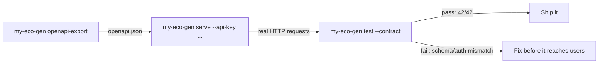

# Validate a Live API Against a Real Contract with Eco-Faker

Export an OpenAPI contract from a generated dataset, serve it as a real mock API, and catch two genuinely common integration bugs — a missing auth header and schema drift — automatically.

## What you'll build

A three-step loop using only the `my-eco-gen` CLI: `openapi-export` produces a contract, `serve` stands up a real mock API matching it, and `test --contract` fires real HTTP requests at that API and validates every response against the contract's declared shape.



## Why use Eco-Faker here?

Contract testing is usually pitched as something you set up *after* a real backend exists — you write an OpenAPI spec, then validate a running service against it. That ordering means the first time you get real signal is after the backend is built, which is exactly when a mismatch is most expensive to fix.

`eco-faker` lets you flip that order. `openapi-export` derives a contract directly from the same generator that would back a mock API — the contract and the API it describes are generated from one source, so on day one they're guaranteed to agree. From there, `test --contract` is real, general-purpose contract-testing tooling: point it at any live API and a spec, and it validates status codes and response shapes with AJV, not eco-faker-specific logic. You get the contract-testing habit and tooling in place before a real backend exists, so it's already part of the workflow once one does.

## Prerequisites

- Node.js 18+ (built and verified on Node v22.22.2)

```bash
mkdir cli-serve-contract-test && cd cli-serve-contract-test
npm init -y
npm install eco-faker
```

Final folder structure:

```
cli-serve-contract-test/
├── package.json
└── scripts/
    └── run-demo.mjs
```

## Step 1 — Export the contract

```bash
npx my-eco-gen openapi-export --seed 42 --users 20 --output ./openapi.json --port 4900
```

**Expected output:**

```
Written to ./openapi.json
```

This is a real OpenAPI 3.0 document — every table gets a `GET /api/<table>` (list) and `GET /api/<table>/{id}` (detail) path, with response schemas derived from the actual generated field types. `--port` here is cosmetic (recorded in the contract's `servers` field only); it doesn't start anything.

## Step 2 — Serve a real mock API, with auth required

```bash
npx my-eco-gen serve --seed 42 --users 20 --port 4900 --api-key SECRET123 --quiet
```

**Expected output:**

```
Generating dataset...
Ready in 125.5ms: 20 users, 28 orders, 29 shipments, 1 returns.
Mock API running at http://localhost:4900
  ...
  auth ON: send "Authorization: Bearer SECRET123" or every /api/* request gets a 401
```

Same seed, same user count as Step 1 — the server matches the contract exactly. `--api-key` is what makes the first failing scenario below possible.

## Step 3 — The passing case

```bash
npx my-eco-gen test --url http://localhost:4900 --contract ./openapi.json --header "Authorization: Bearer SECRET123"
```

**Actual output (unedited):**

```
ok:   GET /api/products -> 200
ok:   GET /api/orders -> 200
...
ok:   GET /api/products/{id} -> 200
...
42 passed, 0 failed.
```

Every list and every detail route, real HTTP requests, real AJV schema validation against the contract — all 42 checks green.

**A mistake worth pointing out before you make it:** `--url` should be the API's *origin*, not include the `/api` prefix — the contract's own paths already start with `/api/...`. `--url http://localhost:4900/api` (with the prefix) doubles it into `/api/api/products` and 404s everywhere. Use `--url http://localhost:4900`.

## Step 4 — Failing case 1: a missing auth header

Run the exact same command, minus the header:

```bash
npx my-eco-gen test --url http://localhost:4900 --contract ./openapi.json
```

**Actual output (unedited):**

```
ok:   GET /api/products -> 401
...
FAIL: GET /api/products/{id}
      no sample id available for /api/products -- its list response returned no records, or that path isn't declared in this contract
...
21 passed, 21 failed.
```

This is a subtler failure than it looks. The **list** requests actually "pass" — 401 is a status the contract legitimately documents as possible for every route, so getting one isn't a contract violation. The real failure is on the **detail** routes: since the (401'd) list responses came back with no data, the test tool had no real id to substitute into `/api/products/{id}`, so those checks fail outright. A missing-auth misconfiguration doesn't show up as "401 not allowed" — it shows up as "downstream checks couldn't even run." That's a genuinely useful thing to see once, on purpose, before it happens to you for real.

## Step 5 — Failing case 2: contract drift

This time, the server is fine — the *contract* is wrong. Simulate someone hand-editing the spec to add a field the API doesn't actually return yet (a very real scenario: frontend and backend specs drifting apart during active development):

```javascript
import { readFileSync, writeFileSync } from "node:fs";

const contract = JSON.parse(readFileSync("./openapi.json", "utf-8"));
const productsSchema = contract.components.schemas.Products;
productsSchema.properties.loyaltyTier = { type: "string" };
productsSchema.required = [...(productsSchema.required ?? []), "loyaltyTier"];
writeFileSync("./openapi-drifted.json", JSON.stringify(contract, null, 2));
```

```bash
npx my-eco-gen test --url http://localhost:4900 --contract ./openapi-drifted.json --header "Authorization: Bearer SECRET123"
```

**Actual output (unedited):**

```
FAIL: GET /api/products (http://localhost:4900/api/products)
      /data/0 must have required property 'loyaltyTier'
      /data/1 must have required property 'loyaltyTier'
      ...
FAIL: GET /api/products/{id} (http://localhost:4900/api/products/f98668bb-...)
      (root) must have required property 'loyaltyTier'

40 passed, 2 failed.
```

This is the canonical contract-testing catch: the server is completely healthy, every other route passes, and the tool still caught the exact two routes affected by the drift, with an exact, actionable AJV error naming the missing field.

## Testing

All of the above was run for real, in sequence, against a single live server — not fabricated output. `scripts/run-demo.mjs` orchestrates it as one script:

```bash
npm run demo
```

```
======================================================================
3. PASSING case -- correct auth header, unmodified contract
======================================================================
...
42 passed, 0 failed.
EXPECTED: all checks passed.

======================================================================
4. FAILING case -- missing auth header (real, common misconfiguration)
======================================================================
...
21 passed, 21 failed.
EXPECTED: list requests succeed (401 is a documented status), but detail requests fail --
          no sample id could be harvested from an empty/401'd list response.

======================================================================
5. FAILING case -- contract drift (schema declares a field the API doesn't return)
======================================================================
...
40 passed, 2 failed.
EXPECTED: schema validation caught the field the contract now (falsely) requires.

======================================================================
All three scenarios behaved as documented.
======================================================================
```

## Common mistakes

- **`--url` including `/api`.** Covered above — the contract's paths already have the prefix; doubling it 404s every request.
- **Treating every non-200 as a contract failure.** It isn't — the contract declares every status a route can legitimately return (`200, 401, 429, 500` for an auth-protected route), and `test --contract` checks against *that* set, not just 200. A 401 you didn't expect is a real bug in your auth setup, but it won't show up as a contract violation on its own; watch for downstream effects (like the missing-sample-id failures above) instead.
- **Forgetting `--seed`/`--users` have to match between `openapi-export` and `serve`.** They don't strictly have to for the contract's *shape* to stay valid (field types don't change), but matching them makes `--header`-driven debugging sane — same dataset, same ids, reproducible failures.
- **Running `--mutate` (write-path checks) against anything but a disposable environment.** `test --contract --mutate` fires real POST/PATCH requests. Fine against a local `serve` instance; never point it at a shared staging environment without knowing exactly what it'll create.

## Production tips

- **Export the contract as a build artifact, not a hand-maintained file.** Since it's derived from the generator, regenerating it on every change is cheap and guarantees it never drifts from what `serve` actually returns — the entire point of Step 5's demo is what happens when that discipline lapses.
- **Run the passing case in CI on every PR**, and treat any new failure as a real regression, not flakiness — unlike a UI E2E test, a contract-test failure means a specific, named field or status code changed shape.
- **Use `--header` for auth in CI the same way you would locally** — inject the API key from a secret, not a hardcoded value, but keep the exact same command shape.
- **CI**: this is naturally fast (no browser, no frontend framework) — a few seconds for `serve` to boot plus the HTTP round trips. Good candidate for running on every commit, not just merges.

## Complete source code

```
cli-serve-contract-test/
├── package.json
└── scripts/
    └── run-demo.mjs
```

`scripts/run-demo.mjs` orchestrates Steps 1–5 as one script: exports a contract, starts a real `serve` process, runs all three `test --contract` scenarios, and asserts each behaved as documented above. Runnable with:

```bash
npm install
npm run demo
```

## Next steps

- **GitHub Actions**: wire `npm run demo` into a workflow job — it's already CI-shaped (clear pass/fail, no external services, a few seconds of runtime).
- **`test --contract --mutate`** — the write-path counterpart to everything here: idempotency, race conditions, and invalid status transitions, fired as real POST/PATCH requests.
- **`test --scenario`** — multi-step, ordered flows (create a cart → check out → ship → attempt an illegal cancel) against the same contract-tested API, threading real ids between steps.
