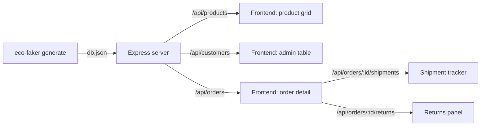

# Build a Fake Shopify Backend in 10 Minutes

Stand up a realistic, relationally-consistent e-commerce REST API — products, customers, orders, shipments, returns, with search, filtering, and pagination — before a single line of real backend code exists.

## What you'll build

A local Express server backed by an Eco-Faker dataset, exposing:

```
GET  /api/products              ?q=&categoryId=&brandId=&minPrice=&maxPrice=&sort=&page=&limit=
GET  /api/products/:id
GET  /api/customers             ?q=&sort=&page=&limit=
GET  /api/customers/:id
GET  /api/orders                ?status=&userId=&q=&sort=&page=&limit=
GET  /api/orders/:id
GET  /api/orders/:id/shipments
GET  /api/orders/:id/returns
GET  /api/shipments             ?status=&carrier=&page=&limit=
GET  /api/returns               ?status=&page=&limit=
```



The dataset isn't five independent arrays of random JSON — every order belongs to a real customer, every shipment belongs to a real order, every return traces back to a real delivered order. That relational integrity is the entire point: it's what lets you build an order-detail page that shows the customer, their address, the line items, the shipment tracking, and any return — all cross-referenced correctly — without a database.

## Why use Eco-Faker here?

The usual options for "I need a backend to build against" are all bad in the same way:

- **Hand-written fixtures** (`{ id: 1, name: "Product A" }`) don't have enough volume or variety to catch pagination bugs, empty states, or long-name overflow in your UI.
- **`json-server` + a static `db.json`** gets you REST for free, but you write the fake data by hand — so it's small, and nothing is *related*. Your "orders" don't reference real "customers"; there's no realistic distribution of order statuses.
- **Waiting for the real backend** blocks frontend work for however long the API takes to ship, and once it exists, you're often rate-limited, need real auth, or can't run destructive tests against it anyway.

Eco-Faker generates a full relational dataset in one deterministic call — same seed in, byte-identical data out, every time, on every machine. You get 300 customers, 250 products with variants, hundreds of orders in realistic status distributions, shipments with carrier/tracking data, and a plausible return rate — all cross-referenced by real IDs. You write your own Express routes on top of it, so the API shape matches exactly what your frontend will eventually call, not whatever shape a generic mock tool defaults to.

## Prerequisites

- Node.js 18+ (this tutorial was built and verified on Node v22.22.2, npm 10.9.7)
- Basic familiarity with Express

```bash
mkdir express-shopify-backend && cd express-shopify-backend
npm init -y
npm install eco-faker express
```

Final folder structure (this is where we're headed):

```
express-shopify-backend/
├── package.json
├── db.json                # generated dataset (git-ignore or regenerate in CI)
├── scripts/
│   └── generate.mjs        # one-time dataset generation
└── src/
    ├── paginate.js          # shared pagination/search helper
    └── server.mjs           # the Express app
```

## Step 1 — Generate the dataset

Eco-Faker's `generate()` is a plain function: pass a config, get back a fully-materialized `Dataset` object with everything already wired together. We call it once, in a build step, and write the result to `db.json`. The server later just reads that file — it doesn't regenerate data on every boot, which matters once you have hundreds of orders and want the API to start instantly.

The `seed` is what makes this reproducible: every teammate who runs this script gets the *exact same* 300 customers, 250 products, and orders — byte for byte. That's what makes a bug report like "order `016f4060...` shows the wrong shipment status" reproducible across machines.

```javascript
// scripts/generate.mjs
import { writeFileSync } from "node:fs";
import { generate } from "eco-faker";

const dataset = generate({
  seed: 42, // fixed seed -> byte-identical dataset every time you run this
  scaleFactor: 300, // ~300 core users, everything else derived relationally
  catalogSize: 250, // 250 products across the shared catalog
  historicalDays: 90, // 90 days of order/shipment/return history
  returnRate: 0.12,
  abandonmentRate: 0.25,
});

writeFileSync("db.json", JSON.stringify(dataset, null, 2));

console.log(
  `Generated ${dataset.products.length} products, ${dataset.users.length} customers, ` +
    `${dataset.orders.length} orders, ${dataset.shipments.length} shipments, ` +
    `${dataset.returnRequests.length} returns -> db.json`
);
```

Add a script to `package.json`:

```json
"scripts": {
  "generate": "node scripts/generate.mjs",
  "dev": "node src/server.mjs"
}
```

Run it:

```bash
npm run generate
```

**Expected output:**

```
Generated 250 products, 300 customers, 567 orders, 597 shipments, 20 returns -> db.json
```

`db.json` now contains fully cross-referenced arrays — `products`, `users`, `carts`, `abandonedCheckouts`, `orders`, `shipments`, `returnRequests`, plus supporting tables like `categories`, `brands`, and `productViews` you won't need for this tutorial but are there if you want them later.

## Step 2 — A shared pagination + search helper

Every list route (`/api/products`, `/api/customers`, `/api/orders`, ...) needs the same three things: page/limit slicing, an optional sort key, and a consistent response envelope (`{ data, pagination }`). Writing that logic five times means five places to introduce an off-by-one bug. Instead, we write it once.

```javascript
// src/paginate.js
export function paginate(items, req, { defaultSort } = {}) {
  const page = Math.max(1, parseInt(req.query.page, 10) || 1);
  const limit = Math.min(100, Math.max(1, parseInt(req.query.limit, 10) || 20));

  let sorted = items;
  const sortKey = req.query.sort || defaultSort;
  if (sortKey) {
    const desc = sortKey.startsWith("-");
    const key = desc ? sortKey.slice(1) : sortKey;
    sorted = [...items].sort((a, b) => {
      const av = a[key];
      const bv = b[key];
      if (av === bv) return 0;
      const cmp = av > bv ? 1 : -1;
      return desc ? -cmp : cmp;
    });
  }

  const total = sorted.length;
  const start = (page - 1) * limit;
  const data = sorted.slice(start, start + limit);

  return {
    data,
    pagination: { page, limit, total, totalPages: Math.max(1, Math.ceil(total / limit)) },
  };
}

// Case-insensitive substring match across a fixed set of fields.
// Used by every "?q=" search param below.
export function matchesQuery(record, fields, q) {
  if (!q) return true;
  const needle = q.toLowerCase();
  return fields.some((field) => String(record[field] ?? "").toLowerCase().includes(needle));
}
```

`sort=-createdAt` (leading `-` for descending) is a small, well-known convention — it reads naturally and doesn't need a second query param.

## Step 3 — The Express server

We load `db.json` once at boot and build a couple of lookup `Map`s for joins (`categoryById`, `brandById`, `userById`) so we're not doing an `O(n)` scan on every request. Products also get `categoryName`/`brandName` denormalized onto them once at startup — a real frontend product grid wants the category name to display, not just an opaque `categoryId` it has to look up separately.

```javascript
// src/server.mjs
import { readFileSync } from "node:fs";
import express from "express";
import { paginate, matchesQuery } from "./paginate.js";

const db = JSON.parse(readFileSync(new URL("../db.json", import.meta.url)));

const categoryById = new Map(db.categories.map((c) => [c.id, c]));
const brandById = new Map(db.brands.map((b) => [b.id, b]));
const userById = new Map(db.users.map((u) => [u.id, u]));

const products = db.products.map((p) => ({
  ...p,
  categoryName: categoryById.get(p.categoryId)?.name ?? null,
  brandName: brandById.get(p.brandId)?.name ?? null,
}));

const app = express();
app.use(express.json());

app.get("/health", (_req, res) => res.json({ status: "ok" }));

// ---------- Products ----------
app.get("/api/products", (req, res) => {
  const { q, categoryId, brandId, minPrice, maxPrice } = req.query;
  let filtered = products;
  if (q) filtered = filtered.filter((p) => matchesQuery(p, ["name", "sku"], q));
  if (categoryId) filtered = filtered.filter((p) => p.categoryId === categoryId);
  if (brandId) filtered = filtered.filter((p) => p.brandId === brandId);
  if (minPrice) filtered = filtered.filter((p) => p.basePrice >= Number(minPrice));
  if (maxPrice) filtered = filtered.filter((p) => p.basePrice <= Number(maxPrice));
  res.json(paginate(filtered, req, { defaultSort: "name" }));
});

app.get("/api/products/:id", (req, res) => {
  const product = products.find((p) => p.id === req.params.id);
  if (!product) return res.status(404).json({ error: "Product not found" });
  res.json(product);
});

// ---------- Customers ----------
app.get("/api/customers", (req, res) => {
  const { q } = req.query;
  let filtered = db.users;
  if (q) filtered = filtered.filter((u) => matchesQuery(u, ["firstName", "lastName", "email"], q));
  res.json(paginate(filtered, req, { defaultSort: "createdAt" }));
});

app.get("/api/customers/:id", (req, res) => {
  const customer = userById.get(req.params.id);
  if (!customer) return res.status(404).json({ error: "Customer not found" });
  res.json(customer);
});

// ---------- Orders ----------
app.get("/api/orders", (req, res) => {
  const { status, userId, q } = req.query;
  let filtered = db.orders;
  if (status) filtered = filtered.filter((o) => o.status === status);
  if (userId) filtered = filtered.filter((o) => o.userId === userId);
  if (q) filtered = filtered.filter((o) => matchesQuery(o, ["id", "totalFormatted"], q));
  res.json(paginate(filtered, req, { defaultSort: "-createdAt" }));
});

app.get("/api/orders/:id", (req, res) => {
  const order = db.orders.find((o) => o.id === req.params.id);
  if (!order) return res.status(404).json({ error: "Order not found" });
  res.json(order);
});

app.get("/api/orders/:id/shipments", (req, res) => {
  res.json({ data: db.shipments.filter((s) => s.orderId === req.params.id) });
});

app.get("/api/orders/:id/returns", (req, res) => {
  res.json({ data: db.returnRequests.filter((r) => r.orderId === req.params.id) });
});

// ---------- Shipments ----------
app.get("/api/shipments", (req, res) => {
  const { status, carrier } = req.query;
  let filtered = db.shipments;
  if (status) filtered = filtered.filter((s) => s.status === status);
  if (carrier) filtered = filtered.filter((s) => s.carrier === carrier);
  res.json(paginate(filtered, req, { defaultSort: "trackingNumber" }));
});

app.get("/api/shipments/:id", (req, res) => {
  const shipment = db.shipments.find((s) => s.id === req.params.id);
  if (!shipment) return res.status(404).json({ error: "Shipment not found" });
  res.json(shipment);
});

// ---------- Returns ----------
app.get("/api/returns", (req, res) => {
  const { status } = req.query;
  let filtered = db.returnRequests;
  if (status) filtered = filtered.filter((r) => r.status === status);
  res.json(paginate(filtered, req, { defaultSort: "-requestedAt" }));
});

app.get("/api/returns/:id", (req, res) => {
  const ret = db.returnRequests.find((r) => r.id === req.params.id);
  if (!ret) return res.status(404).json({ error: "Return not found" });
  res.json(ret);
});

const port = process.env.PORT || 4001;
app.listen(port, () => console.log(`Fake Shopify backend listening on http://localhost:${port}`));
```

Start it:

```bash
npm run dev
```

**Expected output:**

```
Fake Shopify backend listening on http://localhost:4001
```

## Testing

All of the following were run against the actual server above — not hypothetical output.

```bash
curl -s http://localhost:4001/health
# {"status":"ok"}

curl -s "http://localhost:4001/api/products?q=chair&limit=2"
# {"data":[
#   {"id":"f5114083-...","name":"Blanda - Cremin Licensed Bronze Chair","basePrice":239.19,"categoryName":"Building Sets","brandName":"Blanda - Cremin", ...},
#   {"id":"e5c4b041-...","name":"Heidenreich - Fahey Luxurious Granite Chair","basePrice":43.29,"categoryName":"Activewear", ...}
# ],"pagination":{"page":1,"limit":2,"total":7,"totalPages":4}}

curl -s "http://localhost:4001/api/orders?status=delivered&limit=1"
# {"data":[{"id":"2c953e29-...","status":"delivered","total":7943.52,"totalFormatted":"$7,943.52", ...}],
#  "pagination":{"page":1,"limit":1,"total":325,"totalPages":325}}

curl -s "http://localhost:4001/api/orders/016f4060-550c-4ef8-84bb-69d308a996a0/shipments"
# {"data":[{"id":"7fa57d80-...","orderId":"016f4060-...","trackingNumber":"NLSPI1M79OGP","carrier":"UPS","status":"Label Created","delayed":false, ...}]}

curl -s "http://localhost:4001/api/products/does-not-exist"
# {"error":"Product not found"}   -- HTTP 404
```

A frontend engineer can point a product grid, a customer table, and an order-detail page with a shipment tracker and returns panel at this API right now — same URL shapes, same query params, same response envelope they'll get from the real backend later.

## Common mistakes

- **Regenerating the dataset on every server start without a fixed seed.** `generate()` defaults `referenceNow` to the current wall-clock time, so two runs even seconds apart can shift "last N days" windows slightly. Always pass an explicit `seed`, and only regenerate `db.json` deliberately (a build step or CI job), not on every `npm run dev`.
- **Filtering by category *name* instead of `categoryId`.** Names aren't unique-safe query keys and force a string match on every request. Filter by `categoryId`; use the denormalized `categoryName` only for *display*.
- **Forgetting `Math.min(100, ...)` on `limit`.** Without a ceiling, `?limit=999999` returns the entire table in one response — fine with this dataset's size, not fine once you 10x `scaleFactor`.
- **Re-deriving `categoryById`/`brandById` inside the route handler.** Building lookup maps per-request instead of once at boot turns an O(1) join into an O(n) scan on every single call — invisible at 300 users, very visible at 50,000.

## Production tips

- **Commit `db.json` or generate it in CI**, not on every deploy — keep it deterministic and reviewable like any other fixture.
- **Never let this server run in production** — it's a development/staging tool. Guard it explicitly: `if (process.env.NODE_ENV === "production") process.exit(1)` at the top of `server.mjs` is a cheap insurance policy against someone accidentally pointing a real environment at it.
- **Bump `scaleFactor`/`catalogSize` gradually and watch response times** — the in-memory `Array.filter` approach here is fine up to tens of thousands of rows; past that, load `db.json` into SQLite (Eco-Faker's `--format sql` output does this directly) and query with indexes instead.
- **CI**: add a step that runs `npm run generate && npm run dev &` then curls `/health` and a couple of representative endpoints before running your frontend's E2E suite against it — catches "the mock server didn't start" before it becomes a flaky test failure.
- **Repository structure** for a team using this across multiple frontends:
  ```
  packages/
    fake-backend/       # this project, published internally or run via `npx`
    frontend-web/
    frontend-admin/
  ```

## Complete source code

```
express-shopify-backend/
├── package.json
├── db.json
├── scripts/
│   └── generate.mjs
└── src/
    ├── paginate.js
    └── server.mjs
```

`package.json`:

```json
{
  "name": "express-shopify-backend",
  "version": "1.0.0",
  "private": true,
  "type": "module",
  "scripts": {
    "generate": "node scripts/generate.mjs",
    "dev": "node src/server.mjs"
  },
  "dependencies": {
    "eco-faker": "^0.2.0",
    "express": "^5.2.1"
  }
}
```

The three source files are exactly as shown in Steps 1–3 above — copy them in as-is; the whole project is runnable with:

```bash
npm install
npm run generate
npm run dev
```

## Next steps

- **Next.js App Router + Eco-Faker** — fetch this same dataset directly from React Server Components instead of over HTTP, and see when a network hop is worth keeping vs. cutting.
- **MSW + Vitest** — mock this same API at the network layer for component/unit tests instead of running a real Express process, so tests work fully offline.
- **Contract testing with `test --contract`** — export this server's shape as an OpenAPI spec and validate it automatically, so this fake backend and your eventual real one can't silently drift apart.
