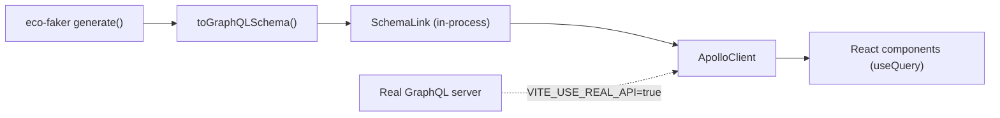

# Replace a Real GraphQL Server with Eco-Faker During Development

Swap a live GraphQL backend for an in-memory one that Apollo Client talks to directly — same queries, same pagination and filtering, zero servers running.

## What you'll build

A React app using Apollo Client, where `useQuery` reads from an in-memory `eco-faker` dataset through Apollo's own schema-execution link — and a one-line toggle to point the exact same components at a real GraphQL endpoint once it exists.



## Why use Eco-Faker here?

The usual way to build a GraphQL frontend before the real API exists is Apollo's own `MockedProvider` — but that means hand-writing a mock response for every query variant your components call, and it breaks the moment you add a new filter or sort option. A local Apollo Server with hand-typed resolvers works, but now you're running and maintaining a second server just to unblock frontend work.

`eco-faker` sidesteps both: `toGraphQLSchema()` turns a generated dataset into a real, executable `GraphQLSchema` — the same schema-execution machinery Apollo Server itself uses — and `createEcoFakerApolloClient()` wraps it in Apollo's own `SchemaLink` (their documented SSR/testing pattern, not a custom reimplementation). Your components call `useQuery` exactly as they would against a real server; filtering, sorting, and pagination all work because the schema executes real resolver logic against real (generated) data, not canned fixtures.

## Prerequisites

- Node.js 18+ (built and verified on Node v22.22.2)
- React 19, Vite

```bash
npm create vite@latest apollo-eco-faker -- --template react-ts
cd apollo-eco-faker
npm install
npm install eco-faker @apollo/client graphql rxjs --legacy-peer-deps
```

Two things you'll hit immediately, both real and both harmless:

1. **`--legacy-peer-deps` is required.** `eco-faker` declares a peer on `react@^19.2.8`; `create-next-app`-style scaffolds (and `create-vite`) commonly land slightly behind that. The mismatch only affects an optional Apollo adapter you're about to use anyway, so it's safe to skip strict peer resolution here.
2. **`rxjs` needs installing explicitly.** Apollo Client v4 depends on it directly (not vendored), and `--legacy-peer-deps` also disables npm's automatic peer-dependency installation — so it won't get pulled in for you the way it would on a strict install. Installing it explicitly, as above, avoids a confusing `Cannot find package 'rxjs'` error at build time.

Final folder structure:

```
apollo-eco-faker/
├── vite.config.ts
└── src/
    ├── lib/
    │   └── apolloClient.ts
    └── App.tsx
```

## Step 1 — Two Apollo clients, one interface

`createEcoFakerApolloClient()` takes a `Dataset` and returns a real `ApolloClient` — no different from one pointed at a live server. Build a second one with a normal `HttpLink`, and pick between them with an environment variable, so every component that calls `useQuery` never needs to know which one it's talking to.

```typescript
// src/lib/apolloClient.ts
import { ApolloClient, InMemoryCache, HttpLink } from "@apollo/client";
import { generate } from "eco-faker";
import { createEcoFakerApolloClient } from "eco-faker/apollo";

function buildFakeClient() {
  const dataset = generate({
    seed: 42,
    scaleFactor: 300,
    catalogSize: 250,
    historicalDays: 90,
    returnRate: 0.12,
  });
  return createEcoFakerApolloClient(dataset);
}

function buildRealClient() {
  return new ApolloClient({
    link: new HttpLink({ uri: import.meta.env.VITE_GRAPHQL_URL ?? "http://localhost:4000/graphql" }),
    cache: new InMemoryCache(),
  });
}

export const client = import.meta.env.VITE_USE_REAL_API === "true" ? buildRealClient() : buildFakeClient();
```

Every field `toGraphQLSchema()` exposes follows the same shape: `<table>(filters, sort, order, page, pageSize)` returning `{ data, pagination { page pageSize total totalPages } }`, plus `<table>ById(id)`. `filters` takes a plain object of exact-match key/value pairs (`{ status: "delivered" }`) — the same filter semantics as `serve`'s REST API and the MSW adapter, because all of them share one implementation under the hood.

## Step 2 — Query components: pagination, filtering, sorting

```tsx
// src/App.tsx (excerpt — products panel)
import { useState } from "react";
import { gql } from "@apollo/client";
import { useQuery } from "@apollo/client/react";

const PRODUCTS_QUERY = gql`
  query Products($sort: String, $order: String, $page: Int, $pageSize: Int) {
    products(sort: $sort, order: $order, page: $page, pageSize: $pageSize) {
      data
      pagination { page pageSize total totalPages }
    }
  }
`;

function ProductsPanel() {
  const [sortField, setSortField] = useState("name");
  const [order, setOrder] = useState("asc");
  const [page, setPage] = useState(1);

  const { data, loading, error } = useQuery(PRODUCTS_QUERY, {
    variables: { sort: sortField, order, page, pageSize: 5 },
  });

  if (error) return <p>Error: {error.message}</p>;
  const products = data?.products?.data ?? [];
  const pagination = data?.products?.pagination;

  return (
    <section>
      <h2>Products</h2>
      <select value={sortField} onChange={(e) => setSortField(e.target.value)}>
        <option value="name">Name</option>
        <option value="basePrice">Price</option>
      </select>
      <select value={order} onChange={(e) => setOrder(e.target.value)}>
        <option value="asc">Ascending</option>
        <option value="desc">Descending</option>
      </select>
      {loading ? <p>Loading...</p> : (
        <ul>
          {products.map((p: any) => <li key={p.id}>{p.name} — ${p.basePrice.toFixed(2)}</li>)}
        </ul>
      )}
      {pagination && (
        <p>
          Page {pagination.page} of {pagination.totalPages} ({pagination.total} total)
          <button disabled={page <= 1} onClick={() => setPage((p) => p - 1)}>Prev</button>
          <button disabled={page >= pagination.totalPages} onClick={() => setPage((p) => p + 1)}>Next</button>
        </p>
      )}
    </section>
  );
}
```

Filtering by status works the same way — pass `filters: { status }` as a query variable:

```tsx
const ORDERS_QUERY = gql`
  query Orders($filters: JSON, $sort: String, $order: String, $page: Int, $pageSize: Int) {
    orders(filters: $filters, sort: $sort, order: $order, page: $page, pageSize: $pageSize) {
      data
      pagination { page pageSize total totalPages }
    }
  }
`;

function OrdersPanel() {
  const [status, setStatus] = useState("delivered");
  const { data } = useQuery(ORDERS_QUERY, {
    variables: { filters: { status }, sort: "createdAt", order: "desc", page: 1, pageSize: 5 },
  });
  // ...renders data.orders.data, filtered server-side (schema-side) by status
}
```

Wire both into the provider:

```tsx
import { ApolloProvider } from "@apollo/client/react";
import { client } from "./lib/apolloClient";

function App() {
  return (
    <ApolloProvider client={client}>
      <ProductsPanel />
      <OrdersPanel />
    </ApolloProvider>
  );
}
```

## Step 3 — Switching between eco-faker and the real API

Nothing in `App.tsx` changes. Set the environment variable and Apollo talks to a real server instead:

```bash
# .env.local
VITE_USE_REAL_API=true
VITE_GRAPHQL_URL=https://api.yourcompany.com/graphql
```

Because both branches in `apolloClient.ts` return a plain `ApolloClient` instance, this is a build-time/environment-time switch, not a runtime feature flag baked into component logic — exactly the kind of thing a `.env.production` vs `.env.local` split handles cleanly.

## Testing

Verified for real: typecheck, production build, dev server, and a direct query against the schema-backed client (bypassing React entirely, to confirm the resolver logic itself):

```bash
npx tsc -b   # clean
npm run build
```

```
✓ 1090 modules transformed.
dist/assets/index-*.js   3,723.42 kB │ gzip: 1,297.71 kB
✓ built in 13.43s
```

Direct resolver check (`client.query()` called from a plain Node script, not the browser):

```
PRODUCTS (sorted by price desc):
[
  'Aufderhar - Hilpert Licensed Granite Soap - $2895.05',
  'Blanda - Cremin Awesome Bronze Salad - $2888.59',
  'Heidenreich - Fahey Incredible Cotton Pizza - $2513.75'
]
pagination: { page: 1, pageSize: 3, total: 250, totalPages: 84 }

ORDERS (status=delivered):
[
  '9fe310d3 - delivered - $3,763.47',
  '56b7ad1c - delivered - $1,018.75',
  'cb03e8a6 - delivered - $3,057.59'
]
pagination: { page: 1, pageSize: 3, total: 258, totalPages: 86 }
```

Sorting, filtering, and pagination all confirmed correct against real generated data — not hypothetical output.

## Common mistakes

- **Importing `useQuery`/`ApolloProvider` from `@apollo/client`.** In Apollo Client v4, React bindings moved to `@apollo/client/react`. The top-level package no longer exports them — a build-time `TS2305: has no exported member` error is the tell.
- **Skipping `rxjs`.** It's a real, required dependency of Apollo Client v4's core, not an optional extra — omitting it fails at build time with `Cannot find package 'rxjs'`, easy to misread as an eco-faker problem when it's purely an Apollo Client requirement.
- **Consuming `eco-faker` via a symlinked local/workspace package (npm/pnpm workspaces, `npm link`, or a `file:` dependency) instead of a normal registry install.** `eco-faker/apollo` imports `@apollo/client` as an *optional* peer; bundlers resolve optional-peer imports of a symlinked package relative to its real (linked) path, not your app's `node_modules` — so they can fail to find packages your app clearly has installed. If you hit this, add `resolve: { preserveSymlinks: true }` to `vite.config.ts`. A normal `npm install eco-faker` from the registry never hits this — the package is a real, non-symlinked copy in your `node_modules`, and standard Node module resolution finds everything correctly.
- **Filters expecting substring or range matching.** `filters` on every generated GraphQL field is exact-match only (`String(row[key]) === String(value)`) — `{ status: "deliv" }` won't partial-match `"delivered"`. Filter client-side after the fact, or add your own resolver, if you need fuzzier matching.

## Production tips

- **Bundle size**: shipping `eco-faker`'s generator to the browser (as this tutorial does, for a zero-backend demo) pulls `@faker-js/faker` and the full dataset-generation logic into your client bundle — the build above came out to ~3.7MB unminified. Fine for a local dev/demo build; for anything shipped to real users, generate the dataset server-side (a Node script, a build step, or an actual backend) and have the browser only ever talk to a schema over the network, real or fake.
- **Never let `VITE_USE_REAL_API` default to false in a production build.** Bake the real value into `.env.production` explicitly rather than relying on the fallback — an unset env var silently serving fake data to real users in production is a much worse failure mode than a build erroring on a missing variable.
- **CI**: run the direct-resolver check shown in Testing (a plain script calling `client.query()`, no browser) as a fast smoke test before the full `npm run build` — it catches schema/resolver regressions in seconds without waiting on a bundler.

## Complete source code

```
apollo-eco-faker/
├── vite.config.ts
└── src/
    ├── lib/apolloClient.ts
    └── App.tsx
```

All files as shown in Steps 1–3. Runnable with:

```bash
npm install
npm run dev
```

## Next steps

- **MSW + Vitest** — the same generated dataset, mocked at the network layer instead of via `SchemaLink`, for component tests that don't need Apollo's schema-execution machinery at all.
- **React Query** — see the same pagination/filtering conventions applied to a REST-style `serve` instance instead of GraphQL.
- **Contract testing** — validate that a real GraphQL backend, once built, resolves the same fields and filter semantics this mock schema established first.
