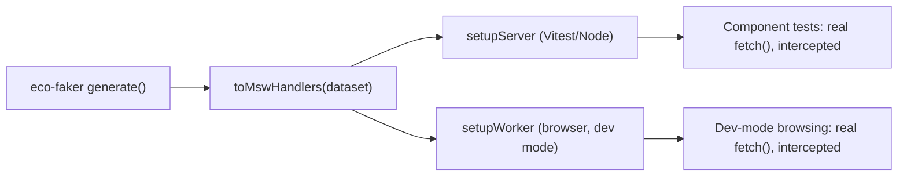

# Mock an Entire REST Backend with Eco-Faker + MSW

Test real fetch() calls against a realistic, relational dataset — no backend running, no fetch mocking library, fully offline.

## What you'll build

A React app fetching products and orders over real `fetch()` calls, with MSW intercepting those requests at the network layer — one set of handlers shared between Vitest component tests and an actual offline dev-mode browser session.



## Why is MSW superior to manually mocking fetch()?

The reflexive way to test a component that calls `fetch()` is `vi.fn()` or `global.fetch = vi.fn(...)`. It works for one call, and then it doesn't scale:

- Every test re-specifies the exact response shape for every URL it expects — miss one, and the component silently gets `undefined`.
- Nothing verifies the request was even shaped correctly (right method, right query params) — a typo'd URL and a correct one both "pass" if you didn't assert on the call.
- Pagination, filtering, and sorting either don't exist in the mock at all, or get hand-rolled per test, and drift the moment the real API's query semantics change.

MSW intercepts at the network layer instead: your component code calls a real, unmodified `fetch("/api/products?page=2")`, and MSW's request handlers respond as a real server would — including 404s, headers, and query-string parsing. `eco-faker`'s `toMswHandlers(dataset)` generates those handlers directly from the same filter/sort/paginate logic `serve` uses, so there's no separate mock-response-shape to maintain by hand, and pagination/filtering genuinely work rather than being stubbed.

## Prerequisites

- Node.js 18+ (built and verified on Node v22.22.2)
- Vite + React + Vitest

```bash
npm create vite@latest msw-eco-faker -- --template react-ts
cd msw-eco-faker
npm install
npm install eco-faker msw --legacy-peer-deps
npm install -D vitest @testing-library/react @testing-library/dom @testing-library/jest-dom jsdom
npx msw init public/ --save
```

`--legacy-peer-deps` is the same react-peer-version workaround as the other eco-faker + frontend-framework tutorials. `npx msw init public/` is not optional — it copies MSW's browser Service Worker script into `public/`; skip it and `setupWorker(...).start()` fails at runtime with a missing-service-worker error the first time you actually open the app in dev mode. It only matters for the browser worker (Step 4); the Vitest/Node side doesn't need it.

Final folder structure:

```
msw-eco-faker/
├── vite.config.ts
├── public/
│   └── mockServiceWorker.js      (generated by `msw init`)
└── src/
    ├── api.ts
    ├── App.tsx
    ├── App.test.tsx
    ├── main.tsx
    ├── lib/dataset.ts
    ├── mocks/
    │   ├── handlers.ts
    │   ├── server.ts             (Node, for tests)
    │   └── browser.ts            (browser, for dev mode)
    └── test/setup.ts
```

## Step 1 — One dataset, one set of handlers

```typescript
// src/lib/dataset.ts
import { generate } from "eco-faker";

export const dataset = generate({
  seed: 42,
  scaleFactor: 300,
  catalogSize: 250,
  historicalDays: 90,
  returnRate: 0.12,
});
```

```typescript
// src/mocks/handlers.ts
import { toMswHandlers } from "eco-faker/msw";
import { dataset } from "../lib/dataset";

export const handlers = toMswHandlers(dataset);
```

`toMswHandlers` generates `GET /api/<table>` (paginated, filterable by exact-match query params, sortable) and `GET /api/<table>/:id` for every table in the dataset — `products`, `users`, `orders`, `shipments`, `returns`, and more — mirroring `serve`'s REST routes exactly, including the same `X-Eco-Faker-Meaning` response header. Both the test server and the dev-mode browser worker import this same `handlers` array, so "what my tests mock" and "what I browse against locally" can never drift apart.

## Step 2 — Two consumers of the same handlers

```typescript
// src/mocks/server.ts (Node, used by Vitest)
import { setupServer } from "msw/node";
import { handlers } from "./handlers";

export const server = setupServer(...handlers);
```

```typescript
// src/mocks/browser.ts (browser, used in dev mode)
import { setupWorker } from "msw/browser";
import { handlers } from "./handlers";

export const worker = setupWorker(...handlers);
```

## Step 3 — Real fetch(), no test-awareness

```typescript
// src/api.ts
export async function fetchProducts(params: { page?: number; pageSize?: number } = {}) {
  const search = new URLSearchParams();
  if (params.page) search.set("page", String(params.page));
  if (params.pageSize) search.set("pageSize", String(params.pageSize));
  const res = await fetch(`/api/products?${search.toString()}`);
  if (!res.ok) throw new Error(`Failed to fetch products: ${res.status}`);
  return res.json();
}

export async function fetchOrders(params: { status?: string; page?: number; pageSize?: number } = {}) {
  const search = new URLSearchParams();
  if (params.status) search.set("status", params.status);
  if (params.page) search.set("page", String(params.page));
  if (params.pageSize) search.set("pageSize", String(params.pageSize));
  const res = await fetch(`/api/orders?${search.toString()}`);
  if (!res.ok) throw new Error(`Failed to fetch orders: ${res.status}`);
  return res.json();
}
```

This file is identical to what it would be talking to a real backend — nothing here knows MSW exists.

## Step 4 — Vitest setup and a real component test

```typescript
// src/test/setup.ts
import "@testing-library/jest-dom/vitest";
import { afterAll, afterEach, beforeAll } from "vitest";
import { server } from "../mocks/server";

beforeAll(() => server.listen({ onUnhandledRequest: "error" }));
afterEach(() => server.resetHandlers());
afterAll(() => server.close());
```

```typescript
// vite.config.ts
/// <reference types="vitest/config" />
import { defineConfig } from "vite";
import react from "@vitejs/plugin-react";

export default defineConfig({
  plugins: [react()],
  test: {
    environment: "jsdom",
    setupFiles: ["./src/test/setup.ts"],
    globals: true,
  },
});
```

```tsx
// src/App.test.tsx (excerpt)
import { render, screen, waitFor, fireEvent } from "@testing-library/react";
import { http, HttpResponse } from "msw";
import { server } from "./mocks/server";
import App from "./App";

it("renders products and orders from the mocked API", async () => {
  render(<App />);
  await waitFor(() => {
    expect(screen.getByTestId("products-total")).toHaveTextContent("products in catalog");
  });
  expect(screen.getByTestId("products-list").children.length).toBe(5);
});

it("handles a real server error via a one-off handler override", async () => {
  // Override just this test's response -- no need to touch the component.
  server.use(http.get("*/api/products", () => HttpResponse.json({ error: "boom" }, { status: 500 })));
  render(<App />);
  await waitFor(() => {
    expect(screen.queryByTestId("products-loading")).not.toBeInTheDocument();
  });
});
```

`server.use(...)` layers a one-off handler on top of the defaults for a single test — `resetHandlers()` in the setup file's `afterEach` clears it automatically, so error-path tests can't leak into the next test.

## Testing

```bash
npm run test
```

```
 ✓ src/App.test.tsx (3 tests) 226ms

 Test Files  1 passed (1)
      Tests  3 passed (3)
```

All three tests — happy path, filter-and-refetch, and a simulated server error — ran against real `fetch()` calls intercepted by MSW, not hand-written response stubs.

```bash
npm run build
```

```
dist/assets/index-*.js   192.65 kB │ gzip: 60.67 kB
✓ built in 411ms
```

Notably small: `main.tsx` only `import()`s the MSW browser worker when `import.meta.env.MODE === "development"`, so none of the mocking code ships in the production bundle.

## Common mistakes

- **Forgetting `npx msw init public/ --save`.** The dev-mode browser worker needs `public/mockServiceWorker.js` to register a real Service Worker; without it, `worker.start()` fails at runtime the first time you load the app, not at build time — easy to miss until you actually open the browser.
- **Not resetting handlers between tests.** Skip `server.resetHandlers()` in `afterEach`, and a `server.use(...)` override from an error-path test silently leaks into the next test that expects the happy path.
- **`onUnhandledRequest: "bypass"` everywhere.** Set to `"error"` in tests (as above) so a component fetching a URL you forgot to mock fails loudly, instead of MSW silently letting the real network request through (or failing with a confusing generic network error in a test environment with no real network).
- **Consuming `eco-faker` via a symlinked local/workspace package.** As with the other framework tutorials, doing this can cause `msw`'s own types to be loaded from two different locations, producing a spurious `Property 'resolver' is protected` TypeScript error on `setupServer(...handlers)`/`setupWorker(...handlers)`. A normal `npm install eco-faker` from the registry never hits this — verified directly against the published package with zero type errors.

## Production tips

- **Ship zero mocking code to production.** The `import.meta.env.MODE` gate in `main.tsx` means `vite build` never bundles `msw/browser` or the handlers for a real deployment — confirm this by checking your build output doesn't include `mockServiceWorker` or MSW's runtime.
- **CI**: run `npm run test` before `npm run build` — MSW tests run in milliseconds with no server to boot, so they're the cheapest signal in the pipeline and should fail fast before spending time on a full build.
- **Keep one `handlers.ts`, shared everywhere.** Route "which handlers does my test/dev-mode session use" through a single file, the way this tutorial does — a second, hand-copied set of handlers for "just this one test file" is exactly the drift MSW's shared-handler pattern exists to prevent.

## Complete source code

```
msw-eco-faker/
├── vite.config.ts
└── src/
    ├── api.ts
    ├── App.tsx
    ├── App.test.tsx
    ├── main.tsx
    ├── lib/dataset.ts
    ├── mocks/{handlers,server,browser}.ts
    └── test/setup.ts
```

All files as shown in Steps 1–4. Runnable with:

```bash
npm install
npx msw init public/ --save
npm run test
npm run dev
```

## Next steps

- **Playwright** — the same generated dataset and deterministic seed, driving real end-to-end browser tests instead of component-level ones.
- **React Query** — layer caching, pagination, and optimistic updates on top of the same MSW-mocked endpoints.
- **Contract testing** — validate that a real backend, once built, matches the request/response shapes these handlers established first.
