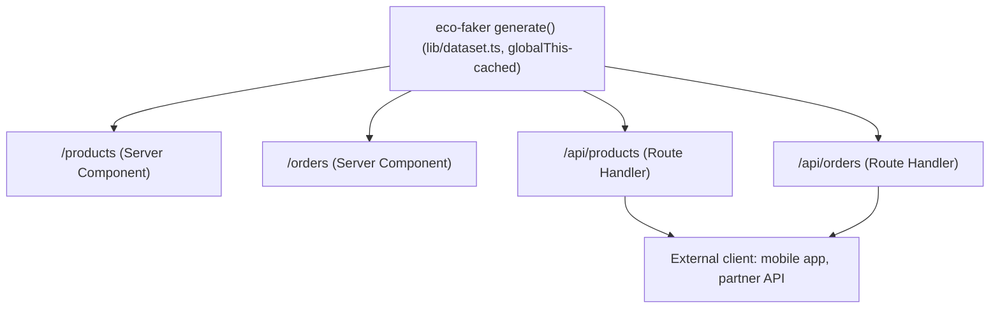

# Integrate Eco-Faker into a Next.js App Router Project

Render products and orders straight from the server, with zero network round-trips, using a relationally-consistent generated dataset instead of a real database.

## What you'll build

A Next.js (App Router) app with:

- A shared, in-memory dataset generated once by `eco-faker`
- Two React Server Components (`/products`, `/orders`) that read the dataset directly — no `fetch`, no API round trip
- Two Route Handlers (`/api/products`, `/api/orders`) exposing the same data as JSON, for any client that isn't this app (a mobile client, a partner integration, a future real backend's contract to match)



## Why use Eco-Faker here?

App Router's whole pitch is that Server Components can talk to data directly — no client-side `fetch`, no loading spinner, no waterfall. That's great once you have a database. Before you do, the usual workaround is either a hand-rolled array of three fake products (fine for a demo, useless for testing a paginated table or an empty-state), or standing up a real Postgres instance just to build a product grid.

`eco-faker`'s `generate()` gives you a full relational dataset — 300 customers, 250 products, hundreds of orders with real status distributions — as a plain in-memory object, synchronously, with no network or database involved. Server Components can import it directly, the same way they'd import a database client, and you get realistic pagination, empty states, and data variety from day one.

## Prerequisites

- Node.js 18+ (built and verified on Node v22.22.2)
- Next.js 16 (App Router)

```bash
npx create-next-app@latest nextjs-eco-faker --typescript --eslint --app --no-tailwind --no-src-dir
cd nextjs-eco-faker
npm install eco-faker
```

**You'll likely hit this immediately** — `eco-faker` currently declares a peer dependency on `react@^19.2.8` (for its optional Apollo adapter) that's slightly ahead of what `create-next-app` scaffolds (`19.2.4` at the time of writing). npm's strict peer resolution treats that as a hard conflict even though the peer is marked optional:

```bash
npm install eco-faker --legacy-peer-deps
```

This is safe here — you're not using the Apollo adapter, so the version mismatch is irrelevant to anything this tutorial does.

Final folder structure:

```
nextjs-eco-faker/
├── next.config.ts
├── lib/
│   └── dataset.ts
└── app/
    ├── layout.tsx
    ├── products/
    │   └── page.tsx
    ├── orders/
    │   └── page.tsx
    └── api/
        ├── products/route.ts
        └── orders/route.ts
```

## Step 1 — One shared dataset, generated once

`generate()` is a plain, synchronous function — call it once and reuse the result. The trap: Next's dev server (Turbopack/Fast Refresh) re-executes route and page modules on file changes, which would silently regenerate a *different* dataset on every save (timestamps shift because `referenceNow` defaults to the current time). Stashing the dataset on `globalThis` survives that — it's the same pattern you'd use for a Prisma client singleton.

```typescript
// lib/dataset.ts
import { generate, type Dataset } from "eco-faker";

declare global {
  // eslint-disable-next-line no-var
  var __ecoFakerDataset: Dataset | undefined;
}

function buildDataset(): Dataset {
  return generate({
    seed: 42,
    scaleFactor: 300,
    catalogSize: 250,
    historicalDays: 90,
    returnRate: 0.12,
  });
}

export const dataset: Dataset = globalThis.__ecoFakerDataset ?? (globalThis.__ecoFakerDataset = buildDataset());
```

## Step 2 — A config fix bundlers need

Next.js bundles server code with Turbopack/webpack. `eco-faker`'s default entry point re-exports optional integration adapters (GraphQL, tRPC, MSW, Apollo) for people who use them — but a bundler doing static analysis tries to resolve *all* of those imports at build time, including packages you never installed because you don't need them:

```
Module not found: Can't resolve 'graphql'
Import traces:
  ./node_modules/eco-faker/dist/graphql.js
  ./node_modules/eco-faker/dist/serve.js
  ./node_modules/eco-faker/dist/index.js
  ./lib/dataset.ts
```

`generate()` never touches that code path at runtime — this is purely a static-analysis false positive. The fix is one line: tell Next to treat `eco-faker` as an external package on the server, so it's `require()`'d at runtime instead of bundled.

```typescript
// next.config.ts
import type { NextConfig } from "next";

const nextConfig: NextConfig = {
  serverExternalPackages: ["eco-faker"],
};

export default nextConfig;
```

## Step 3 — Server Components that read the dataset directly

No `fetch`, no `useEffect`, no loading state — the component runs on the server, so it just reads the in-memory object.

```tsx
// app/products/page.tsx
import { dataset } from "@/lib/dataset";

export default function ProductsPage() {
  const products = dataset.products.slice(0, 24);

  return (
    <main style={{ padding: 32, fontFamily: "sans-serif" }}>
      <h1>Products</h1>
      <p>{dataset.products.length} products in the catalog (showing first 24)</p>
      <div style={{ display: "grid", gridTemplateColumns: "repeat(auto-fill, minmax(220px, 1fr))", gap: 16 }}>
        {products.map((product) => (
          <div key={product.id} style={{ border: "1px solid #ddd", borderRadius: 8, padding: 16 }}>
            <strong>{product.name}</strong>
            <div style={{ color: "#666", fontSize: 14 }}>{product.sku}</div>
            <div style={{ marginTop: 8 }}>
              ${product.basePrice.toFixed(2)} {product.currency}
            </div>
          </div>
        ))}
      </div>
    </main>
  );
}
```

```tsx
// app/orders/page.tsx
import { dataset } from "@/lib/dataset";

export default function OrdersPage() {
  const userById = new Map(dataset.users.map((u) => [u.id, u]));
  const orders = [...dataset.orders].sort((a, b) => (a.createdAt < b.createdAt ? 1 : -1)).slice(0, 25);

  return (
    <main style={{ padding: 32, fontFamily: "sans-serif" }}>
      <h1>Recent orders</h1>
      <p>{dataset.orders.length} total orders (showing 25 most recent)</p>
      <table style={{ borderCollapse: "collapse", width: "100%" }}>
        <thead>
          <tr style={{ textAlign: "left", borderBottom: "2px solid #ddd" }}>
            <th style={{ padding: 8 }}>Order</th>
            <th style={{ padding: 8 }}>Customer</th>
            <th style={{ padding: 8 }}>Status</th>
            <th style={{ padding: 8 }}>Total</th>
            <th style={{ padding: 8 }}>Placed</th>
          </tr>
        </thead>
        <tbody>
          {orders.map((order) => {
            const customer = userById.get(order.userId);
            return (
              <tr key={order.id} style={{ borderBottom: "1px solid #eee" }}>
                <td style={{ padding: 8, fontFamily: "monospace", fontSize: 12 }}>{order.id.slice(0, 8)}</td>
                <td style={{ padding: 8 }}>{customer ? `${customer.firstName} ${customer.lastName}` : "Unknown"}</td>
                <td style={{ padding: 8 }}>{order.status}</td>
                <td style={{ padding: 8 }}>{order.totalFormatted}</td>
                <td style={{ padding: 8 }}>{new Date(order.createdAt).toLocaleDateString()}</td>
              </tr>
            );
          })}
        </tbody>
      </table>
    </main>
  );
}
```

## Step 4 — Route Handlers for external clients

Same dataset, exposed as JSON with filtering and pagination — for a mobile app, a partner integration, or to define the contract your real backend will eventually match.

```typescript
// app/api/products/route.ts
import { NextRequest, NextResponse } from "next/server";
import { dataset } from "@/lib/dataset";

export async function GET(request: NextRequest) {
  const { searchParams } = new URL(request.url);
  const q = searchParams.get("q");
  const page = Math.max(1, Number(searchParams.get("page")) || 1);
  const limit = Math.min(100, Math.max(1, Number(searchParams.get("limit")) || 20));

  let products = dataset.products;
  if (q) {
    const needle = q.toLowerCase();
    products = products.filter((p) => p.name.toLowerCase().includes(needle));
  }

  const start = (page - 1) * limit;
  const data = products.slice(start, start + limit);

  return NextResponse.json({
    data,
    pagination: { page, limit, total: products.length, totalPages: Math.max(1, Math.ceil(products.length / limit)) },
  });
}
```

```typescript
// app/api/orders/route.ts
import { NextRequest, NextResponse } from "next/server";
import { dataset } from "@/lib/dataset";

export async function GET(request: NextRequest) {
  const { searchParams } = new URL(request.url);
  const status = searchParams.get("status");
  const page = Math.max(1, Number(searchParams.get("page")) || 1);
  const limit = Math.min(100, Math.max(1, Number(searchParams.get("limit")) || 20));

  let orders = dataset.orders;
  if (status) orders = orders.filter((o) => o.status === status);

  const start = (page - 1) * limit;
  const data = orders.slice(start, start + limit);

  return NextResponse.json({
    data,
    pagination: { page, limit, total: orders.length, totalPages: Math.max(1, Math.ceil(orders.length / limit)) },
  });
}
```

## Testing

All of the following ran against the real project — dev mode, production build, and production server.

```bash
npx tsc --noEmit -p tsconfig.json   # clean, no output

npm run build
```

```
▲ Next.js 16.2.12 (Turbopack)
✓ Compiled successfully in 8.2s
  Running TypeScript ...
  Finished TypeScript in 5.2s ...
✓ Generating static pages using 1 worker (8/8) in 242ms

Route (app)
┌ ○ /
├ ○ /_not-found
├ ƒ /api/orders
├ ƒ /api/products
├ ○ /orders
└ ○ /products

○  (Static)   prerendered as static content
ƒ  (Dynamic)  server-rendered on demand
```

`/products` and `/orders` prerender as **static** content at build time — confirmation the dataset really is generated once, not per-request.

```bash
npm run start
curl "http://localhost:3000/api/products?q=chair&limit=2"
```

```json
{"data":[
  {"id":"f5114083-...","name":"Blanda - Cremin Licensed Bronze Chair","basePrice":239.19, ...},
  {"id":"ed81958a-...","name":"Reichel, Zieme and Gerlach Handmade Steel Chair","basePrice":32.79, ...}
],"pagination":{"page":1,"limit":2,"total":7,"totalPages":4}}
```

```bash
curl "http://localhost:3000/api/orders?status=delivered&limit=1"
# {"data":[{"id":"77d78f2b-...","status":"delivered","totalFormatted":"$1,173.31", ...}],
#  "pagination":{"page":1,"limit":1,"total":258,"totalPages":258}}
```

`npm run dev` was verified separately — same routes, same data, confirming the `globalThis` cache does its job across Fast Refresh.

## Common mistakes

- **Calling `generate()` at module scope without the `globalThis` cache.** In dev mode, Turbopack's Fast Refresh re-executes the module on every save, silently producing a *different* dataset each time — a bug you'll only notice when your order count keeps changing on screen for no reason.
- **Importing `eco-faker`'s default entry in a Route Handler without `serverExternalPackages`.** The build error mentions `graphql`, `msw`, or `@trpc/server` — none of which you're using — because the bundler is statically resolving every export in the barrel file, not just the ones you call.
- **Fetching your own `/api/products` route from a Server Component.** It works, but it's a pointless network hop to talk to your own process — import `lib/dataset.ts` directly instead. Reserve the Route Handlers for clients outside this Next.js app.
- **Forgetting `--legacy-peer-deps` on `npm install eco-faker`** in a fresh Next.js project, then concluding the package is broken. It's a harmless optional-peer version skew, not a real incompatibility.

## Production tips

- **Never regenerate the dataset per request.** The `globalThis` singleton means one `generate()` call per server *process* — critical once `scaleFactor` climbs into the tens of thousands.
- **Static rendering is a feature, not an accident.** Because `/products` and `/orders` don't read cookies, headers, or `searchParams`, Next prerenders them at build time. If you need per-request variation (a `?status=` filter on the RSC page itself, not just the API route), reading `searchParams` in the page component will correctly make it dynamic — verify with `npm run build` that the Route column shows what you expect.
- **CI**: run `npm run build` (not just `next dev` boot) — the bundler-resolution error in Step 2 only surfaces at build time, not in dev mode, so a CI job that skips the production build will miss it entirely.
- **Repository structure** for multiple frontends sharing one fixture generator:
  ```
  packages/
    fixtures/          # thin wrapper re-exporting a configured `dataset`
    web-nextjs/
    admin-nextjs/
  ```

## Complete source code

```
nextjs-eco-faker/
├── next.config.ts
├── lib/
│   └── dataset.ts
└── app/
    ├── layout.tsx
    ├── products/page.tsx
    ├── orders/page.tsx
    └── api/
        ├── products/route.ts
        └── orders/route.ts
```

All five files are exactly as shown in Steps 1–4 above. Runnable with:

```bash
npm install
npm install eco-faker --legacy-peer-deps
npm run dev
```

## Next steps

- **GraphQL + Apollo Client** — replace a real GraphQL server with `eco-faker`'s Apollo adapter, and see the pagination/filtering/sorting conventions that map onto this same dataset.
- **MSW + Vitest** — mock this same data at the network layer for component tests that don't need a running Next.js server at all.
- **Contract testing** — generate an OpenAPI spec from a `serve` instance and validate that your real backend, once it exists, matches the shape these Route Handlers established first.
