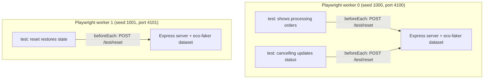

# Deterministic End-to-End Tests with Eco-Faker and Playwright

Run parallel Playwright tests against fully isolated, byte-for-byte reproducible datasets — no shared test database, no order-dependent flakiness.

## What you'll build

A small order-management page (list orders, cancel one) backed by an Express server, tested end-to-end with Playwright. Each test worker gets its **own** server instance and its own deterministic dataset; each individual test resets that dataset back to its pristine state first.



## Why deterministic data reduces flaky tests

E2E tests are usually the flakiest layer of a test suite, and a huge share of that flakiness has nothing to do with the UI — it comes from the *data*. A shared staging database means test order matters (test B assumes an order test A created), real seed data drifts over time (someone's manual QA click leaves the "5 orders" your test expected as "6"), and parallel test runs stomp on each other's state.

`eco-faker`'s `generate({ seed })` produces the exact same dataset — down to specific IDs — every single time for a given seed. Combined with running one server instance per Playwright worker (each with its own seed and port) and resetting to a pristine dataset before every test, three sources of flakiness disappear at once: no cross-worker interference, no cross-test leakage, and a bug report ("order `016f4060...` shows the wrong status") is reproducible on any machine, not just the one that happened to hit it.

## Prerequisites

- Node.js 18+ (built and verified on Node v22.22.2)
- Playwright's browsers installed (see the version note below)

```bash
mkdir playwright-eco-faker && cd playwright-eco-faker
npm init -y
npm install eco-faker express --legacy-peer-deps
npm install -D @playwright/test
npx playwright install chromium
```

**Version note:** pin `@playwright/test` to a version whose bundled Chromium revision you can actually install in your environment (CI images, sandboxed containers, and corporate proxies sometimes lag behind the latest browser build). If `npx playwright test` fails with `Executable doesn't exist at .../chromium_headless_shell-XXXX`, check what revision your installed `playwright-core` expects (`node_modules/playwright-core/browsers.json`) against what `npx playwright install` actually fetched — a version mismatch between the two is the usual cause, not a real bug in your test.

Final folder structure:

```
playwright-eco-faker/
├── playwright.config.ts
├── tsconfig.json
├── fixtures/
│   └── server-fixture.ts
├── src/
│   └── server.mjs
├── public/
│   └── index.html
└── tests/
    └── orders.spec.ts
```

## Step 1 — A server that takes its seed and port from the environment

```javascript
// src/server.mjs
import express from "express";
import { generate } from "eco-faker";

const seed = Number(process.env.SEED ?? 42);
const port = Number(process.env.PORT ?? 3100);

function buildDataset() {
  return generate({ seed, scaleFactor: 50, catalogSize: 40, historicalDays: 30, returnRate: 0.1 });
}

let dataset = buildDataset();

const app = express();
app.use(express.json());
app.use(express.static("public"));

app.get("/api/orders", (req, res) => {
  const { status } = req.query;
  let orders = dataset.orders;
  if (status) orders = orders.filter((o) => o.status === status);
  res.json({ data: orders.slice(0, 10), pagination: { total: orders.length } });
});

// A real state mutation -- what makes this an end-to-end test, not a
// read-only page.
app.post("/api/orders/:id/cancel", (req, res) => {
  const order = dataset.orders.find((o) => o.id === req.params.id);
  if (!order) return res.status(404).json({ error: "Order not found" });
  order.status = "cancelled";
  res.json(order);
});

// Restores the pristine dataset for this seed -- called in `beforeEach`.
app.post("/test/reset", (_req, res) => {
  dataset = buildDataset();
  res.json({ status: "reset", seed });
});

app.listen(port, () => console.log(`eco-faker demo server (seed=${seed}) listening on http://localhost:${port}`));
```

`SEED` and `PORT` aren't hardcoded — the fixture in Step 2 assigns a different value to each Playwright worker.

## Step 2 — One server per worker, via a worker-scoped fixture

```typescript
// fixtures/server-fixture.ts
import { test as base, expect } from "@playwright/test";
import { spawn, type ChildProcess } from "node:child_process";

const BASE_PORT = 4100;
const BASE_SEED = 1000;

async function waitForServer(url: string, timeoutMs = 10_000): Promise<void> {
  const deadline = Date.now() + timeoutMs;
  while (Date.now() < deadline) {
    try {
      const res = await fetch(url);
      if (res.ok) return;
    } catch {
      // not up yet
    }
    await new Promise((resolve) => setTimeout(resolve, 100));
  }
  throw new Error(`Server at ${url} did not become ready within ${timeoutMs}ms`);
}

export const test = base.extend<Record<string, never>, { workerBaseURL: string }>({
  workerBaseURL: [
    async ({}, use, workerInfo) => {
      const port = BASE_PORT + workerInfo.workerIndex;
      const seed = BASE_SEED + workerInfo.workerIndex;
      const url = `http://localhost:${port}`;

      const server: ChildProcess = spawn("node", ["src/server.mjs"], {
        env: { ...process.env, PORT: String(port), SEED: String(seed) },
        stdio: "inherit",
      });

      await waitForServer(`${url}/api/products`);
      await use(url);
      server.kill();
    },
    { scope: "worker" },
  ],
});

export { expect };
```

`{ scope: "worker" }` is what makes this efficient and safe: Playwright creates the fixture once per worker process (not once per test), so every test in that worker shares one server — but two different workers running in parallel never share a port or a seed, because `workerInfo.workerIndex` is unique per worker.

## Step 3 — Tests: reset, mutate, and prove determinism

```typescript
// tests/orders.spec.ts
import { test, expect } from "../fixtures/server-fixture";

test.beforeEach(async ({ workerBaseURL, request }) => {
  // Restore the pristine dataset before every test -- so test execution
  // order and prior mutations (like cancelling an order) never leak
  // between tests, even though every test in this worker shares one server.
  await request.post(`${workerBaseURL}/test/reset`);
});

test("shows processing orders on load", async ({ page, workerBaseURL }) => {
  await page.goto(workerBaseURL);
  await expect(page.getByTestId("order-row").first()).toBeVisible();
});

test("cancelling an order updates its status in the UI", async ({ page, workerBaseURL }) => {
  await page.goto(workerBaseURL);
  const firstRow = page.getByTestId("order-row").first();
  await firstRow.getByTestId("cancel-button").click();
  await expect(firstRow.getByTestId("order-status")).toHaveText("cancelled");
});

test("reset in beforeEach restores state -- no cancelled orders leak in", async ({ page, workerBaseURL }) => {
  await page.goto(workerBaseURL);
  const statuses = await page.getByTestId("order-status").allTextContents();
  expect(statuses).not.toContain("cancelled");
});

test("the same seed always produces the same first order id", async ({ workerBaseURL, request }) => {
  const first = await (await request.get(`${workerBaseURL}/api/orders?status=processing&limit=1`)).json();
  await request.post(`${workerBaseURL}/test/reset`);
  const second = await (await request.get(`${workerBaseURL}/api/orders?status=processing&limit=1`)).json();
  expect(second.data[0].id).toBe(first.data[0].id);
});
```

```typescript
// playwright.config.ts
import { defineConfig, devices } from "@playwright/test";

export default defineConfig({
  testDir: "./tests",
  fullyParallel: true,
  workers: 2,
  projects: [{ name: "chromium", use: { ...devices["Desktop Chrome"] } }],
});
```

## Testing

```bash
npx playwright test
```

```
Running 4 tests using 2 workers

eco-faker demo server (seed=1000) listening on http://localhost:4100
eco-faker demo server (seed=1001) listening on http://localhost:4101
  ✓  1 [chromium] › tests/orders.spec.ts:12:1 › shows processing orders on load (2.2s)
  ✓  2 [chromium] › tests/orders.spec.ts:17:1 › cancelling an order updates its status in the UI (2.5s)
  ✓  4 [chromium] › tests/orders.spec.ts:33:1 › the same seed always produces the same first order id (331ms)
  ✓  3 [chromium] › tests/orders.spec.ts:24:1 › reset in beforeEach restores state -- no cancelled orders leak in (741ms)

  4 passed (5.2s)
```

Ran twice in a row with identical results both times — the fourth test exists specifically to prove that: it fetches the same query before and after a `/test/reset` call and asserts the returned order **id** (not just the count) is byte-identical.

## Common mistakes

- **One shared server for the whole run, with `workers > 1`.** If every worker points at the same server/dataset, two tests cancelling different orders in parallel will still race on writes, or a `beforeEach` reset in one worker will wipe out state a test in another worker is mid-assertion on. The worker-scoped fixture (one server *per worker*) is what makes `workers: 2+` actually safe here, not just fast.
- **Resetting in `afterEach` instead of `beforeEach`.** If a test fails partway through, its `afterEach` may never run. Resetting in `beforeEach` guarantees every test starts clean regardless of how the previous one ended.
- **Forgetting the browser version has to match what's installed.** `npx playwright install` fetches whatever revision the installed `@playwright/test` expects; if you installed browsers before bumping the package version (or vice versa, common in a container with a pre-baked browser cache), you'll get a browser-not-found error that looks unrelated to your test code.
- **Treating `scaleFactor`/`catalogSize` as "the more realistic, the better" for E2E specifically.** A smaller dataset (this tutorial uses `scaleFactor: 50`, not the 300 used in the other tutorials) makes assertions like "the first processing order" fast and unambiguous — E2E tests care about correctness of a specific flow, not dataset scale; save the larger datasets for load/pagination-focused tests.

## Production tips

- **CI**: run with more workers than local (`workers: 4` or higher, matching CI runner cores) — the worker-scoped fixture pattern scales linearly since each worker is fully isolated; there's no shared-state ceiling to hit.
- **Seed offsets, not test names, for worker identity.** `BASE_SEED + workerInfo.workerIndex` is stable across CI re-runs and local runs alike; deriving a seed from a test's title/hash instead would make failures harder to reproduce by hand ("worker 2's seed" is a fact you can look up; "hash of a test name" isn't).
- **Keep the reset endpoint out of anything resembling a production build.** `/test/reset` (and the whole seed/port-from-env pattern) belongs to a test-only server entry point — never wire it into a real deployed API.
- **Trace on failure only** (`trace: "retain-on-failure"` in the config) — full tracing on every run adds overhead disproportionate to the (rare, once data is deterministic) value of a passing test's trace.

## Complete source code

```
playwright-eco-faker/
├── playwright.config.ts
├── fixtures/server-fixture.ts
├── src/server.mjs
├── public/index.html
└── tests/orders.spec.ts
```

All files as shown in Steps 1–3. Runnable with:

```bash
npm install
npx playwright install chromium
npx playwright test
```

## Next steps

- **Contract testing** — validate that `/api/orders`'s shape stays consistent between this deterministic test fixture and a real backend once one exists.
- **React Query** — see the same seeded-dataset-per-worker pattern applied to component-level tests instead of full-browser E2E.
- **MSW + Vitest** — a faster, no-browser-required layer for testing the same order-cancel flow at the component level, reserving Playwright for the handful of true cross-page user journeys.
