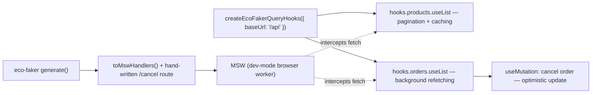

# Use Eco-Faker with TanStack React Query

Get pagination, caching, optimistic updates, and background refetching working against realistic data before your backend exists — with hooks that keep working unchanged once it does.

## What you'll build

A product grid and an order list, both backed by `@tanstack/react-query`, reading from an `eco-faker` dataset mocked at the network layer with MSW.



## Why use Eco-Faker here?

React Query's value shows up in exactly the features this tutorial demonstrates — pagination, caching, optimistic updates, background refetching — and all four are hard to build convincingly against three hand-typed fixture objects. Pagination against three items isn't really pagination. An optimistic update against a mock that always resolves instantly doesn't prove anything about the optimistic-vs-confirmed timing gap. A background refetch against static data has nothing to refetch.

`eco-faker`'s `createEcoFakerQueryHooks({ baseUrl })` generates a full `useList`/`useById` hook per table, with real pagination math and real filtering, wired to whatever's actually mounted at `baseUrl` — a real `serve` instance later, MSW-mocked routes today. Your components import these hooks and never change when the backend arrives; only what's listening at that URL does.

## Prerequisites

- Node.js 18+ (built and verified on Node v22.22.2)
- Vite + React

```bash
npm create vite@latest react-query-eco-faker -- --template react-ts
cd react-query-eco-faker
npm install
npm install eco-faker @tanstack/react-query msw --legacy-peer-deps
npx msw init public/ --save
```

Final folder structure:

```
react-query-eco-faker/
├── src/
│   ├── App.tsx
│   ├── main.tsx
│   ├── lib/
│   │   ├── dataset.ts
│   │   └── queryHooks.ts
│   └── mocks/
│       ├── handlers.ts
│       ├── server.ts
│       └── browser.ts
```

## Step 1 — Dataset, hooks, and the one route eco-faker can't generate for you

```typescript
// src/lib/dataset.ts
import { generate } from "eco-faker";

export const dataset = generate({
  seed: 42,
  scaleFactor: 300,
  catalogSize: 250,
  historicalDays: 90,
  returnRate: 0.12,
});
```

```typescript
// src/lib/queryHooks.ts
import { createEcoFakerQueryHooks } from "eco-faker/react-query";

export const hooks = createEcoFakerQueryHooks({ baseUrl: "/api" });
```

`toMswHandlers()` only generates the **read** side (`GET` list/byId) — reasonable, since there's no generic way to infer what "cancel an order" should mean for your specific app. Write paths are yours to define, mutating the same dataset object the generated `GET` handlers read from:

```typescript
// src/mocks/handlers.ts
import { http, HttpResponse, delay } from "msw";
import { toMswHandlers } from "eco-faker/msw";
import { dataset } from "../lib/dataset";

export const handlers = [
  ...toMswHandlers(dataset),
  http.post("*/api/orders/:id/cancel", async ({ params }) => {
    await delay(800); // deliberate, to make the optimistic-update timing visible
    const order = dataset.orders.find((o) => o.id === params.id);
    if (!order) return HttpResponse.json({ error: "Order not found" }, { status: 404 });
    // eco-faker's own Order.status type is "processing" | "shipped" | "delivered" --
    // it has no idea your app invented a "cancelled" action. A narrow cast at
    // the one line introducing the new value keeps everything else typed.
    (order as { status: string }).status = "cancelled";
    return HttpResponse.json(order);
  }),
];
```

```typescript
// src/mocks/server.ts (Vitest)
import { setupServer } from "msw/node";
import { handlers } from "./handlers";
export const server = setupServer(...handlers);
```

```typescript
// src/mocks/browser.ts (dev mode)
import { setupWorker } from "msw/browser";
import { handlers } from "./handlers";
export const worker = setupWorker(...handlers);
```

## Step 2 — Pagination and caching

```tsx
// src/App.tsx (excerpt)
import { keepPreviousData } from "@tanstack/react-query";
import { hooks } from "./lib/queryHooks";

function ProductsPanel() {
  const [page, setPage] = useState(1);

  // placeholderData: keepPreviousData -- while page 2 loads, keep showing
  // page 1 instead of a loading flash. staleTime: 30s -- returning to a
  // page you already visited within that window is served straight from
  // cache with *no* background refetch, not just "no loading spinner."
  const { data, isLoading, isFetching } = hooks.products.useList(
    { page, pageSize: 5 },
    { placeholderData: keepPreviousData, staleTime: 30_000 }
  );

  const products = (data?.data as unknown as Product[]) ?? [];
  const pagination = data?.pagination;

  if (isLoading) return <p>Loading products...</p>;

  return (
    <section>
      <h2>Products {isFetching && <span>(updating...)</span>}</h2>
      <ul>{products.map((p) => <li key={p.id}>{p.name} — ${p.basePrice.toFixed(2)}</li>)}</ul>
      {pagination && (
        <p>
          Page {pagination.page} of {pagination.totalPages}
          <button disabled={page <= 1} onClick={() => setPage((p) => p - 1)}>Prev</button>
          <button disabled={page >= pagination.totalPages} onClick={() => setPage((p) => p + 1)}>Next</button>
        </p>
      )}
    </section>
  );
}
```

**`isFetching` vs `isLoading`** is the distinction that makes caching visible: `isLoading` is only true before *any* data has ever loaded for this query key; `isFetching` is true any time a request is in flight, including a silent background refetch behind already-cached data.

## Step 3 — Optimistic updates and background refetching

```tsx
const ORDERS_PARAMS = { filters: { status: "processing" }, pageSize: 5 };
const ORDERS_QUERY_KEY = ["eco-faker", "orders", "list", ORDERS_PARAMS] as const;

function OrdersPanel() {
  const queryClient = useQueryClient();

  // refetchInterval keeps this list quietly current -- no polling code,
  // no manual refresh button.
  const { data, dataUpdatedAt } = hooks.orders.useList(ORDERS_PARAMS, { refetchInterval: 4000 });
  const orders = (data?.data as unknown as Order[]) ?? [];

  const cancelMutation = useMutation({
    mutationFn: async (orderId: string) => {
      const res = await fetch(`/api/orders/${orderId}/cancel`, { method: "POST" });
      if (!res.ok) throw new Error("Failed to cancel order");
      return res.json();
    },
    onMutate: async (orderId: string) => {
      await queryClient.cancelQueries({ queryKey: ORDERS_QUERY_KEY });
      const previous = queryClient.getQueryData<ListResult<Order>>(ORDERS_QUERY_KEY);
      queryClient.setQueryData<ListResult<Order>>(ORDERS_QUERY_KEY, (old) =>
        old ? { ...old, data: old.data.map((o) => (o.id === orderId ? { ...o, status: "cancelled" } : o)) } : old
      );
      return { previous };
    },
    onError: (_err, _orderId, context) => {
      if (context?.previous) queryClient.setQueryData(ORDERS_QUERY_KEY, context.previous);
    },
    onSettled: () => queryClient.invalidateQueries({ queryKey: ORDERS_QUERY_KEY }),
  });

  // ...renders orders with a Cancel button calling cancelMutation.mutate(order.id)
}
```

The query key here (`["eco-faker", route, "list", params]`) matches exactly what `createEcoFakerQueryHooks` builds internally — documented in its own source, not guessed — which is what lets `setQueryData`/`getQueryData` target the right cache entry for the optimistic write and rollback.

## Testing

All verified with real component tests (Vitest + Testing Library + MSW), not hypothetical output:

```bash
npm run test
```

```
 ✓ src/App.test.tsx (4 tests) 343ms
   ✓ loads products and paginates
   ✓ caches a previously visited page -- no new fetch going back to it
   ✓ optimistically marks an order cancelled before the server responds
   ✓ background refetching keeps a query updated on an interval with no user action
```

The optimistic-update test asserts the UI shows "cancelled" well within 300ms, against a mocked handler with an 800ms artificial delay — proving the update genuinely comes from `onMutate`, not from the resolved response. The caching test spies on `fetch` directly and asserts exactly two network calls (page 1, page 2) after visiting page 1 → page 2 → page 1, confirming the third visit was served from cache.

```bash
npm run build
```

```
✓ 334 modules transformed.
dist/assets/index-*.js   804.74 kB │ gzip: 297.83 kB
[plugin builtin:vite-reporter]
(!) Some chunks are larger than 500 kB after minification.
```

Notably larger than the equivalent MSW-only tutorial's bundle (192KB) — see Common Mistakes for why, and what to actually do about it.

## Common mistakes

- **Assuming "cached" means "never refetches."** By default, React Query's `staleTime` is `0` — a cached page still shows *instantly* on revisit, but a background refetch fires immediately behind it. If you want a genuinely quiet cache window (no network call at all until some time passes), set `staleTime` explicitly, as this tutorial does for the products list.
- **The `eco-faker/react-query` hooks pull in `express` into your production bundle.** `createEcoFakerQueryHooks` imports `TABLE_ROUTES` from the same module (`serve.js`) that defines eco-faker's actual Express mock server — so anything using these hooks (which, unlike the MSW dev-mode worker, has to run in production too) ends up with Express's transitive imports in the client bundle. Vite auto-externalizes the Node built-ins (`path`, `crypto`, `fs`, etc.) it finds, so the build doesn't hard-fail, but it does bloat the bundle by several hundred KB of dead-in-the-browser code. Confirm your own bundle size before shipping, and if it matters, avoid depending on the hooks at all in a production build (swap `baseUrl` to a real backend and stop importing `eco-faker/react-query` once one exists — exactly the transition this whole tutorial sets up for).
- **Hand-typing the query key for `setQueryData`/`invalidateQueries` from memory instead of matching the hook's actual key.** `createEcoFakerQueryHooks` builds `["eco-faker", route, "list", params ?? {}]` — get the params object's shape wrong (extra/missing field, different key order doesn't matter but different values do) and your optimistic write silently misses the cache entry the UI is actually reading from.
- **`eco-faker`'s `Order.status` doesn't include your app's custom statuses.** Generated data ships `"processing" | "shipped" | "delivered"` only — anything else ("cancelled", "refunded", whatever your app needs) is something you're adding on top, and TypeScript will (correctly) complain if you assign it without a local type extension.

## Production tips

- **Set `staleTime` deliberately per query**, not globally — a product catalog can tolerate minutes of staleness; an inventory count or order status list usually can't.
- **Reserve `refetchInterval` for genuinely live data.** Polling every list on an interval by default adds real server load; pick it per-query, and prefer WebSockets/SSE (eco-faker's own `serve --live-sse` is a good target to swap in later) over polling once real-time matters more.
- **Audit bundle size before shipping** anything that imports `eco-faker/react-query` (or any adapter subpath) into a real production build, per the finding above — either accept the cost if bundle size isn't a real constraint, or make sure this dependency is dev-only and swapped for a real API client before deploying.
- **CI**: run the component tests (fast, no browser, no server) before any E2E suite — they're what actually verify the caching/optimistic-update/refetch *logic*, which a full Playwright run would only incidentally exercise.

## Complete source code

```
react-query-eco-faker/
└── src/
    ├── App.tsx
    ├── App.test.tsx
    ├── main.tsx
    ├── lib/{dataset,queryHooks}.ts
    ├── mocks/{handlers,server,browser}.ts
    └── test/setup.ts
```

All files as shown in Steps 1–3. Runnable with:

```bash
npm install
npx msw init public/ --save
npm run test
npm run dev
```

## Next steps

- **Contract testing** — validate a real backend's `/api/orders` responses match the shape these hooks (and this tutorial's whole mental model) assumed.
- **Playwright** — drive the same cancel-order flow through a real browser instead of component-level tests, with deterministic per-worker datasets.
- **GraphQL + Apollo Client** — the same pagination/caching/optimistic-update concepts, applied to a GraphQL schema instead of REST.
